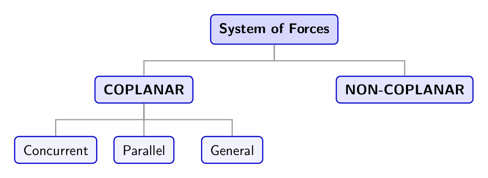
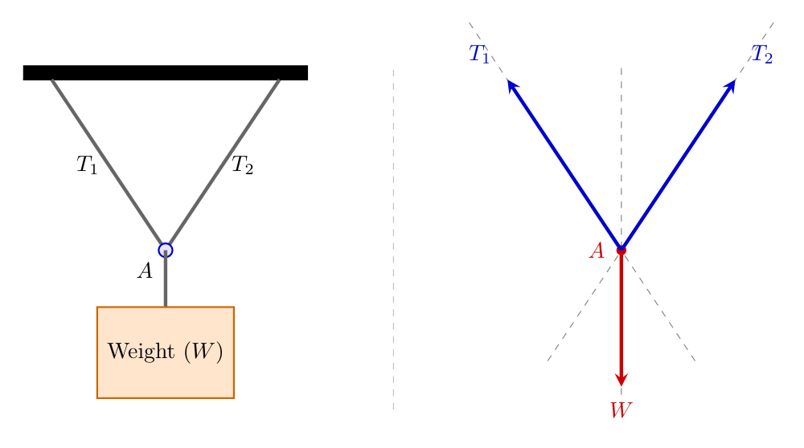
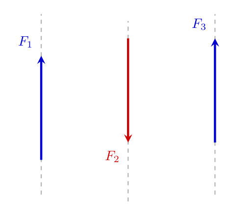
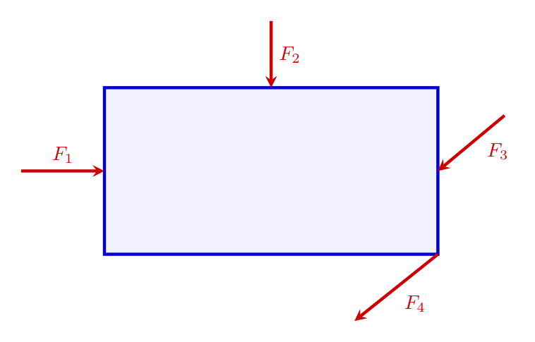
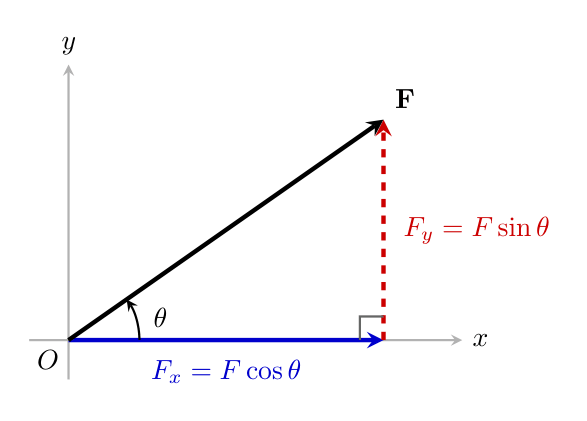
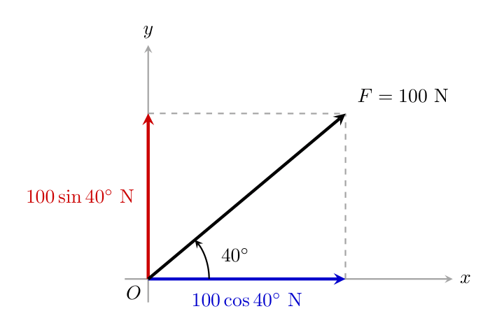
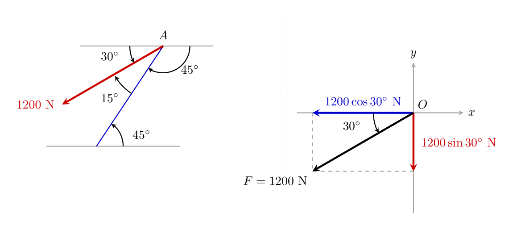

# Engineering Mechanics: System of Forces, Resolution, and Resultant Force

## High-Level Overview

In engineering mechanics, a **force** is an interaction that, when unopposed, changes or tends to change the state of motion or rest of a body. When multiple forces act simultaneously on a structure, machine, or particle, they form a **System of Forces**.

To analyze complex engineering systems, we must answer three fundamental questions:
1. How are forces arranged relative to one another and the spatial dimensions (planes)?
2. How do we break down an inclined or angled force into simpler, orthogonal (perpendicular) directions?
3. How do we combine multiple arbitrary forces into a single equivalent force that produces the exact same physical effect?

### Key Core Concepts
* **Force Vector:** A quantity defined by both a magnitude (how strong it is) and a direction (where it points).
* **Line of Action:** An imaginary infinite straight line extending along the direction vector of a force.
* **Coplanar System:** A set of forces operating strictly within a single two-dimensional plane.
* **Resolution of a Force:** The process of splitting a single inclined force vector into two perpendicular scalar components—typically along horizontal ($x$) and vertical ($y$) axes.
* **Resultant Force ($R$):** A single single vector that completely replaces a system of multiple forces while producing the exact same dynamic or static effect on a body.

---

## Systems of Forces Classification

Forces acting on a body are categorized based on their spatial orientation and whether their lines of action intersect or run parallel.

*Visual Layout:* A tree diagram branching from "System of Forces" at the top into two primary nodes: "COPLANAR" (left) and "NON-COPLANAR" (right). Beneath "COPLANAR", three child branches extend: "Concurrent", "Parallel", and "General".

### 1. Coplanar vs. Non-Coplanar Systems
* **Coplanar System:** All forces in the system lie within a single, shared two-dimensional plane (e.g., $xy$-plane).
* **Non-Coplanar System:** Forces extend into three-dimensional space, lying across multiple, non-parallel planes.

---

### 2. Coplanar Classifications

#### A. Concurrent Force System
A coplanar system where the lines of action of **all** forces intersect at a single common point.

*Visual Layout:* A diagram illustrating a weight $W$ hanging from a central point $A$, supported by two angled cables with tension forces $T_1$ and $T_2$. Below it, a simplified vector diagram shows three force vectors ($T_1$, $T_2$, and $W$) radiating outwards from a single point of origin $A$.

#### B. Parallel Force System
A coplanar system where the lines of action of all forces are parallel to one another and never intersect.

*Visual Layout:* A set of three vertical vectors pointing along parallel vertical lines. Two vectors point upwards and one points downwards, showing parallel lines of action.

#### C. General (Non-Concurrent, Non-Parallel) Force System
A coplanar system containing forces whose lines of action **do not** intersect at a single point and are **not** parallel to each other.

*Visual Layout:* A rectangular block subjected to four distinct forces: $F_1$ pointing horizontally to the right on the left face, $F_2$ pointing vertically downwards at the top center, $F_3$ pointing downwards and to the left on the right face, and $F_4$ pointing downwards and to the left from the bottom-right corner.

---

## Summary Comparison of Force Systems

| System Type | Shared Plane? | Lines of Action Intersect at a Single Point? | Lines of Action Parallel? |
| :--- | :--- | :--- | :--- |
| **Coplanar Concurrent** | Yes | Yes | No |
| **Coplanar Parallel** | Yes | No | Yes |
| **Coplanar General** | Yes | No | No |
| **Non-Coplanar** | No | Varies | Varies |

---

## Resolution of a Force

### 1. Fundamental Principle
Working with forces at arbitrary angles makes structural equilibrium calculations complex. **Resolution** is the mathematical procedure of decomposing a single vector force into two perpendicular (orthogonal) components:
* **Horizontal Component ($F_x$):** The projection of the force vector along the horizontal $x$-axis.
* **Vertical Component ($F_y$):** The projection of the force vector along the vertical $y$-axis.

### 2. Mathematical Formulation

Consider a force vector $\mathbf{F}$ of magnitude $F$ acting at an angle $\theta$ measured directly relative to the **horizontal axis**.

*Visual Layout:* A right-angled triangle where the hypotenuse is a force vector $\mathbf{F}$ inclined at angle $\theta$ relative to the horizontal base. The horizontal base represents $F_x = F \cos\theta$, and the dashed vertical leg represents $F_y = F \sin\theta$.

Using standard right-triangle trigonometry:

$$\cos\theta = \frac{\text{Adjacent}}{\text{Hypotenuse}} = \frac{F_x}{F} \implies F_x = F \cos\theta$$

$$\sin\theta = \frac{\text{Opposite}}{\text{Hypotenuse}} = \frac{F_y}{F} \implies F_y = F \sin\theta$$

> **Crucial Rule for Angle Measurement:**
> The component **adjacent** to the known angle $\theta$ always takes the **cosine ($\cos$)** function, while the component **opposite** to the known angle takes the **sine ($\sin$)** function.

* If angle $\theta$ is measured relative to the **horizontal axis**:
  $$F_x = F \cos\theta, \quad F_y = F \sin\theta$$
* If angle $\phi$ is measured relative to the **vertical axis**:
  $$F_x = F \sin\phi, \quad F_y = F \cos\phi$$

---

## Step-by-Step Breakdown: Computing Resultant Force

To combine a system of multiple coplanar forces into a single equivalent force vector $\mathbf{R}$, follow this standardized four-step procedure:

### Step 1: Sign Convention Establishment
Define standard Cartesian directions:
* **Horizontal ($x$-axis):** Forces pointing Right are Positive ($+$); Forces pointing Left are Negative ($-$);
* **Vertical ($y$-axis):** Forces pointing Upwards are Positive ($+$); Forces pointing Downwards are Negative ($-$).

### Step 2: Summation of Components
Resolve every force vector into its respective horizontal and vertical projections, then algebraically sum them:

$$\Sigma F_x = \text{Sum of all horizontal force components}$$

$$\Sigma F_y = \text{Sum of all vertical force components}$$

### Step 3: Resultant Magnitude
Combine the total scalar components using the Pythagorean Theorem:

$$R = \sqrt{\left(\Sigma F_x\right)^2 + \left(\Sigma F_y\right)^2}$$

### Step 4: Resultant Direction Angle
Determine the angle of inclination $\theta$ of the resultant force relative to the horizontal axis:

$$\theta = \tan^{-1}\left| \frac{\Sigma F_y}{\Sigma F_x} \right|$$

---

## Worked Examples

### Worked Example 1: Resolution of Basic Forces

**Problem Statement:**
Resolve a force magnitude $F = 100\text{ N}$ acting upwards and to the right at an angle of $40^\circ$ relative to the horizontal plane.

*Visual Layout:* A coordinate system showing a vector with magnitude $100\text{ N}$ inclined at $40^\circ$ to the horizontal axis. Dashed vector projections show a vertical upward arrow labeled $100\sin 40^\circ$ and a horizontal rightward arrow labeled $100\cos 40^\circ$.

**Detailed Solution:**

1. **Identify Given Data:**
   * Force Magnitude $F = 100\text{ N}$
   * Angle relative to horizontal $\theta = 40^\circ$

2. **Calculate Horizontal Component ($F_x$):**
   $$F_x = F \cos\theta = 100 \cdot \cos(40^\circ)$$
   $$F_x \approx 100 \cdot 0.7660 = 76.60\text{ N} \quad (\rightarrow)$$

3. **Calculate Vertical Component ($F_y$):**
   $$F_y = F \sin\theta = 100 \cdot \sin(40^\circ)$$
   $$F_y \approx 100 \cdot 0.6428 = 64.28\text{ N} \quad (\uparrow)$$

---

### Worked Example 2: Determining Geometry and Angle via Alternate Interior Angles

**Problem Statement:**
A force vector of magnitude $1200\text{ N}$ acts downward and to the left along an inclined line. The incline makes an angle of $45^\circ$ with the horizontal line below it. The line of action of the force is rotated further by $15^\circ$ relative to that incline. Determine the true horizontal angle of inclination and resolve the force vector into horizontal and vertical components.

*Visual Layout:* A Z-shaped geometric reference figure demonstrating alternate interior angles of $45^\circ$. Beside it, a force line at an angle of $15^\circ$ relative to a $45^\circ$ inclined line is shown. The total angle relative to the top horizontal axis is deduced to be $30^\circ$ ($45^\circ - 15^\circ$). A resolved coordinate system shows the $1200\text{ N}$ vector pointing into the third quadrant with components $1200\cos 30^\circ$ pointing left and $1200\sin 30^\circ$ pointing down.

**Detailed Solution:**

1. **Determine the Effective Angle with the Horizontal:**
   * Using the Z-property of parallel lines (Alternate Interior Angles), the upper reference plane has an angle of $45^\circ$.
   * Since the force arrow deviates towards the horizontal line by $15^\circ$, the angle formed by the force vector with the top horizontal reference line is:
     $$\theta = 45^\circ - 15^\circ = 30^\circ$$

2. **Determine Vector Directions (Quadrant Analysis):**
   * The force points downward and to the left (Quadrant III).
   * Horizontal component $F_x$ points **Left** (Negative Direction).
   * Vertical component $F_y$ points **Downwards** (Negative Direction).

3. **Calculate Components:**
   * **Horizontal Component ($F_x$):**
     $$F_x = 1200 \cdot \cos(30^\circ) = 1200 \cdot 0.8660 = 1039.23\text{ N} \quad (\leftarrow)$$
   * **Vertical Component ($F_y$):**
     $$F_y = 1200 \cdot \sin(30^\circ) = 1200 \cdot 0.5 = 600.00\text{ N} \quad (\downarrow)$$

4. **Vector Representation:**
   $$\Sigma F_x = -1039.23\text{ N}$$
   $$\Sigma F_y = -600.00\text{ N}$$