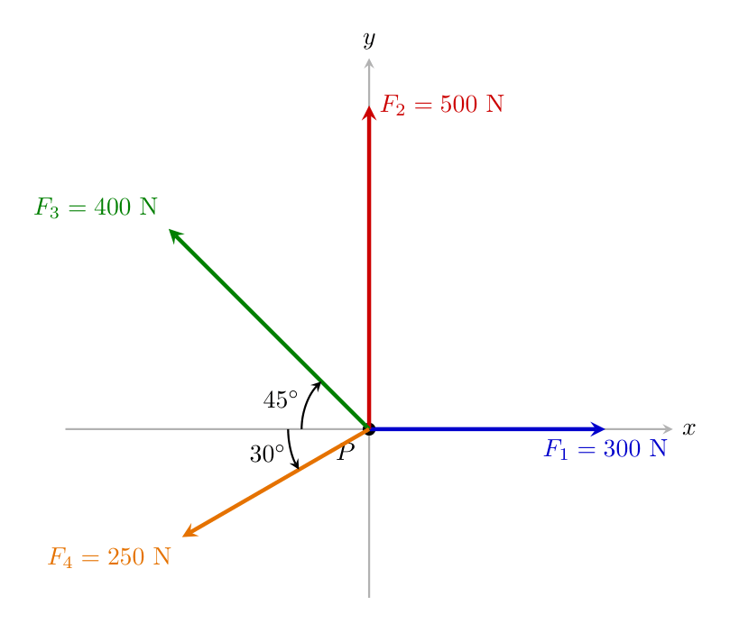
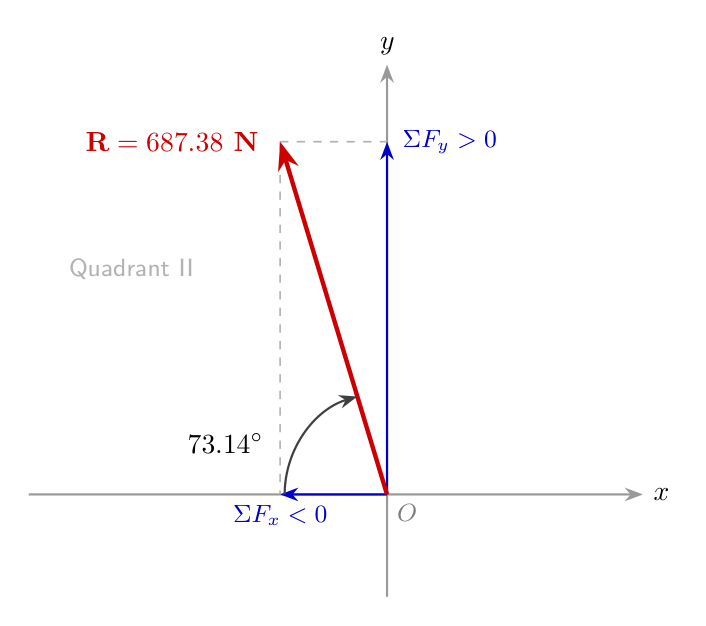
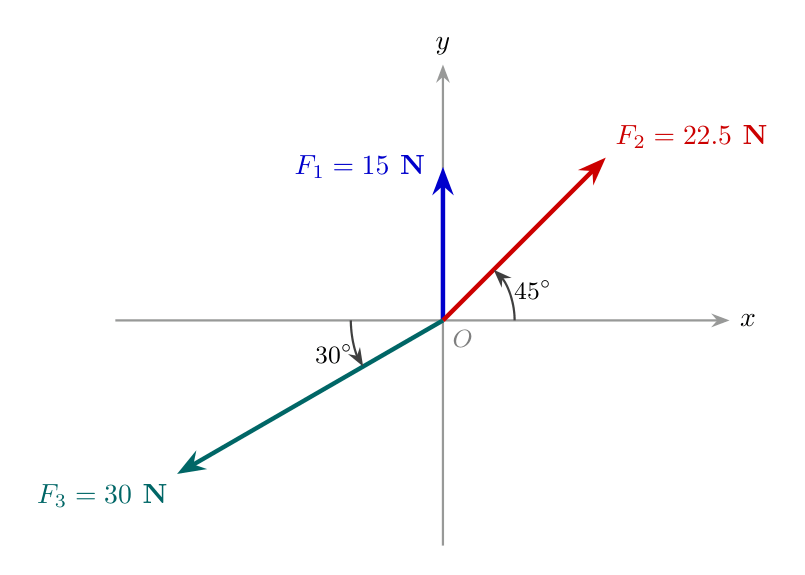
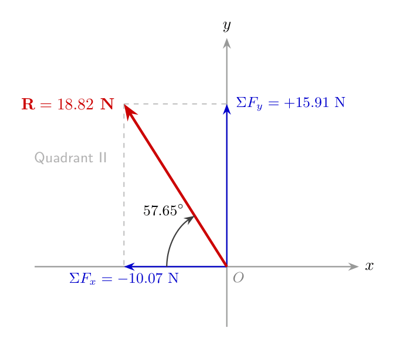

# Engineering Mechanics: Concurrent Force Systems & Resultant Calculations

## High-Level Overview

A **Concurrent Force System** is a system where the lines of action of all applied forces intersect at a single common point. In structural analysis and particle mechanics, calculating the **Resultant Force ($\mathbf{R}$)** allows us to reduce a complex, multi-force system acting on a single particle into one equivalent vector that captures both the overall magnitude and net direction of the applied loads.

### Key Core Concepts
* **Particle Equilibrium & Net Force:** Finding the resultant vector is the first fundamental step in solving both statics (where net force equals zero) and dynamics (where net force produces acceleration).
* **Component Method:** Splitting inclined force vectors into horizontal ($x$) and vertical ($y$) projections makes vector addition simple by converting multi-angle vector geometry into linear arithmetic.
* **Quadrant Direction Analysis:** The algebraic sign ($+$ or $-$) of the summed components ($\Sigma F_x$ and $\Sigma F_y$) determines the exact quadrant in which the resultant vector acts.

---

## Standard Analytical Procedure for Resultant Forces

To solve any 2D concurrent force problem, follow this four-step strategy:

### Step 1: Force Resolution into Components
For each force $F_i$ inclined at an angle $\theta_i$ relative to the horizontal axis:
* **Horizontal Projection:** $F_{i, x} = F_i \cos\theta_i$
* **Vertical Projection:** $F_{i, y} = F_i \sin\theta_i$

> **Directional Sign Convention:**
> * Horizontal: Rightward vectors are **positive ($+$)**; Leftward vectors are **negative ($-$)**.
> * Vertical: Upward vectors are **positive ($+$)**; Downward vectors are **negative ($-$)**.

---

### Step 2: Summation of Orthogonal Components
Sum the scalar force components along both axes algebraically:

$$\Sigma F_x = \sum F_{i, x}$$

$$\Sigma F_y = \sum F_{i, y}$$

---

### Step 3: Resultant Vector Magnitude
Combine the total horizontal and vertical projections using the Pythagorean theorem:

$$R = \sqrt{\left(\Sigma F_x\right)^2 + \left(\Sigma F_y\right)^2}$$

---

### Step 4: Resultant Direction Angle and Orientation
Calculate the acute inclination angle $\theta$ relative to the horizontal axis:

$$\theta = \tan^{-1}\left( \frac{|\Sigma F_y|}{|\Sigma F_x|} \right)$$

#### Quadrant Determination Table

| Sign of $\Sigma F_x$ | Sign of $\Sigma F_y$ | Quadrant | Resultant Orientation |
| :---: | :---: | :---: | :--- |
| $+$ | $+$ | Quadrant I | Upwards and to the Right ($\nearrow$) |
| $-$ | $+$ | Quadrant II | Upwards and to the Left ($\nwarrow$) |
| $-$ | $-$ | Quadrant III | Downwards and to the Left ($\swarrow$) |
| $+$ | $-$ | Quadrant IV | Downwards and to the Right ($\searrow$) |

---

## Worked Examples

### Problem 1: Resultant of Four Concurrent Forces Acting on Particle P

**Problem Statement:**
Find the magnitude and direction of the resultant for four concurrent forces acting at particle $P$:
1. $F_1 = 300\text{ N}$ acting horizontally to the right ($0^\circ$).
2. $F_2 = 500\text{ N}$ acting vertically upwards ($90^\circ$).
3. $F_3 = 400\text{ N}$ acting at $45^\circ$ above the negative horizontal axis (Quadrant II).
4. $F_4 = 250\text{ N}$ acting at $30^\circ$ below the negative horizontal axis (Quadrant III).

*Visual Layout:* A Cartesian plane with origin at particle $P$. $F_1 = 300\text{ N}$ points along the $+x$ axis. $F_2 = 500\text{ N}$ points along the $+y$ axis. $F_3 = 400\text{ N}$ points into Quadrant II making a $45^\circ$ angle with the $-x$ axis. $F_4 = 250\text{ N}$ points into Quadrant III making a $30^\circ$ angle with the $-x$ axis.

---

#### Step-by-Step Solution:

1. **Resolve Individual Force Components:**
   * **$300\text{ N}$ Force:**
     * $F_{1x} = +300\text{ N}$
     * $F_{1y} = 0\text{ N}$
   * **$500\text{ N}$ Force:**
     * $F_{2x} = 0\text{ N}$
     * $F_{2y} = +500\text{ N}$
   * **$400\text{ N}$ Force (Quadrant II):**
     * $F_{3x} = -400 \cos(45^\circ)$
     * $F_{3y} = +400 \sin(45^\circ)$
   * **$250\text{ N}$ Force (Quadrant III):**
     * $F_{4x} = -250 \cos(30^\circ)$
     * $F_{4y} = -250 \sin(30^\circ)$

---

2. **Sum of Horizontal Components ($\Sigma F_x$):**

$$\Sigma F_x = 300 - 400 \cos(45^\circ) - 250 \cos(30^\circ)$$

$$\Sigma F_x = 300 - 400(0.7071) - 250(0.8660)$$

$$\Sigma F_x = 300 - 282.84 - 216.51 = -199.35\text{ N}$$

$$\Sigma F_x = 199.34\text{ N} \quad (\leftarrow)$$

---

3. **Sum of Vertical Components ($\Sigma F_y$):**

$$\Sigma F_y = 500 + 400 \sin(45^\circ) - 250 \sin(30^\circ)$$

$$\Sigma F_y = 500 + 400(0.7071) - 250(0.5)$$

$$\Sigma F_y = 500 + 282.84 - 125 = 657.84\text{ N} \quad (\uparrow)$$

---

4. **Calculate Magnitude of Resultant Force ($R$):**

$$R = \sqrt{(\Sigma F_x)^2 + (\Sigma F_y)^2}$$

$$R = \sqrt{(-199.34)^2 + (657.84)^2}$$

$$R = \sqrt{39736.44 + 432753.47} = \sqrt{472489.91} \approx 687.38\text{ N}$$

---

5. **Calculate Angle of Inclination ($\theta$):**

$$\theta = \tan^{-1}\left| \frac{\Sigma F_y}{\Sigma F_x} \right|$$

$$\theta = \tan^{-1}\left( \frac{657.84}{199.34} \right) = \tan^{-1}(3.3001) \approx 73.14^\circ$$

---

6. **Final Resultant Orientation:**
Since $\Sigma F_x$ is negative ($\leftarrow$) and $\Sigma F_y$ is positive ($\uparrow$), the resultant acts in **Quadrant II** ($\nwarrow$).

*Visual Layout:* A Cartesian graph showing the resultant force vector $R = 687.38\text{ N}$ pointing into Quadrant II, forming an angle of $73.14^\circ$ above the negative $x$-axis.

---

### Problem 2: Resultant of Three Concurrent Forces

**Problem Statement:**
Determine the resultant force vector for three concurrent forces meeting at origin $O$:
1. $F_1 = 15\text{ N}$ acting vertically upwards along the $+y$ axis.
2. $F_2 = 22.5\text{ N}$ acting at an angle of $45^\circ$ above the $+x$ axis (Quadrant I).
3. $F_3 = 30\text{ N}$ acting at an angle of $30^\circ$ below the $-x$ axis (Quadrant III).

*Visual Layout:* A 2D coordinate system displaying $F_1 = 15\text{ N}$ along the $+y$ axis, $F_2 = 22.5\text{ N}$ at $45^\circ$ in Quadrant I, and $F_3 = 30\text{ N}$ at $30^\circ$ below the negative $x$-axis in Quadrant III.

---

#### Step-by-Step Solution:

1. **Sum of Horizontal Components ($\Sigma F_x$):**

$$\Sigma F_x = 22.5 \cos(45^\circ) - 30 \cos(30^\circ)$$

$$\Sigma F_x = 22.5(0.7071) - 30(0.8660)$$

$$\Sigma F_x = 15.91 - 25.98 = -10.07\text{ N}$$

$$\Sigma F_x = 10.07\text{ N} \quad (\leftarrow)$$

---

2. **Sum of Vertical Components ($\Sigma F_y$):**

$$\Sigma F_y = 15 + 22.5 \sin(45^\circ) - 30 \sin(30^\circ)$$

$$\Sigma F_y = 15 + 22.5(0.7071) - 30(0.5)$$

$$\Sigma F_y = 15 + 15.91 - 15 = 15.91\text{ N} \quad (\uparrow)$$

---

3. **Calculate Magnitude of Resultant Force ($R$):**

$$R = \sqrt{(\Sigma F_x)^2 + (\Sigma F_y)^2}$$

$$R = \sqrt{(10.07)^2 + (15.91)^2}$$

$$R = \sqrt{101.41 + 253.13} = \sqrt{354.54} \approx 18.82\text{ N}$$

---

4. **Calculate Direction Angle ($\theta$):**

$$\theta = \tan^{-1}\left| \frac{\Sigma F_y}{\Sigma F_x} \right|$$

$$\theta = \tan^{-1}\left( \frac{15.91}{10.07} \right) = \tan^{-1}(1.580) \approx 57.65^\circ$$

---

5. **Final Resultant Orientation:**
Because $\Sigma F_x = -10.07\text{ N}$ (Left) and $\Sigma F_y = +15.91\text{ N}$ (Up), the resultant acts in **Quadrant II** ($\nwarrow$).

*Visual Layout:* A coordinate axis showing the final resultant vector $R = 18.82\text{ N}$ pointing up and to the left in Quadrant II at an angle of $57.65^\circ$ measured relative to the negative horizontal axis.