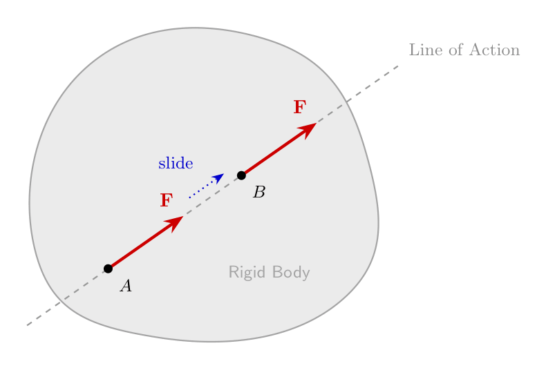
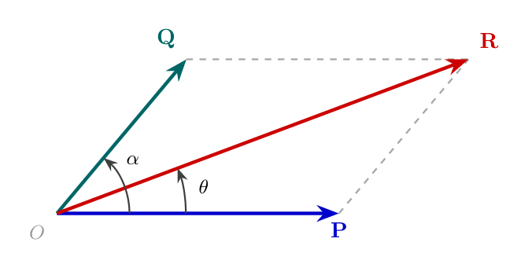
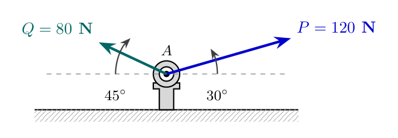
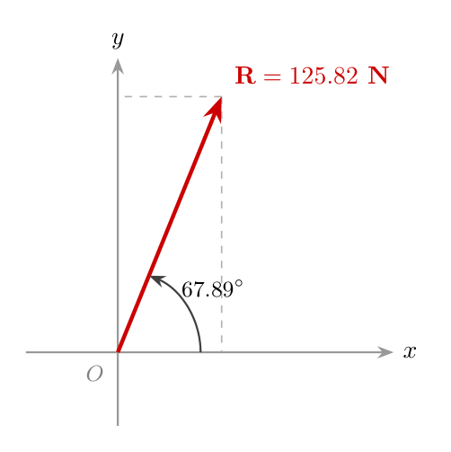

# Engineering Mechanics: Fundamental Laws of Force Systems

## High-Level Overview

In mechanics, understanding how forces transfer through solid bodies and how multiple forces combine at a single point requires two core principles:
1. **Principle of Transmissibility of Force:** Explains how a force can move anywhere along its line of action without altering its external effect on a rigid body.
2. **Parallelogram Law of Forces:** A analytical and geometric method to determine the resultant of two concurrent forces acting at a single point without needing to break them down into Cartesian ($x$-$y$) axes.

---

## Principle of Transmissibility of Force

### Definition
The **Principle of Transmissibility** states that the state of rest or motion of a rigid body remains **unchanged** if a force acting at a given point is replaced by another force of the **same magnitude and direction**, acting at any other point along the **same line of action**.

> **Sliding Vector Concept:**
> A force acting on a rigid body is classified as a **sliding vector**. As long as the magnitude, direction, and line of action remain constant, the point of application can slide anywhere along that line of action without changing the overall external equilibrium or dynamic response of the body.

*Visual Layout:* An irregularly shaped rigid body crossed by a single infinite line of action. A force vector $\mathbf{F}$ is shown at an initial point of application near the bottom-left edge. An identical vector $\mathbf{F}$ is shown further up along the exact same dashed line of action, illustrating that sliding the point of application along this line produces identical external effects.

### Practical Example
Consider pushing versus pulling a stalled car:
* **Pushing** from the rear bumper with a force of $200\text{ N}$ along the horizontal centerline.
* **Pulling** from the front tow hook with a force of $200\text{ N}$ along the exact same horizontal line.

According to the Principle of Transmissibility, both actions produce the exact same external motion/acceleration of the vehicle because both forces share the same magnitude ($200\text{ N}$), direction (forward), and line of action.

---

## Parallelogram Law of Forces

### Statement
If two forces acting simultaneously at a point on a body are represented in **magnitude and direction** by two adjacent sides of a parallelogram, their **resultant force** is represented in magnitude and direction by the **diagonal** of the parallelogram passing through their common point of intersection.

*Visual Layout:* Two forces $\mathbf{P}$ and $\mathbf{Q}$ originate from a common point at an angle $\alpha$ relative to each other. $\mathbf{P}$ lies along the horizontal base and $\mathbf{Q}$ is inclined. Dashed lines complete the parallelogram. A solid vector arrow extending from the common origin to the opposite corner represents the resultant vector $\mathbf{R}$, forming an angle $\theta$ with force $\mathbf{P}$.

---

### Key Variables & Definitions
* $P$ = Magnitude of the first force vector ($\mathbf{P}$)
* $Q$ = Magnitude of the second force vector ($\mathbf{Q}$)
* $\alpha$ = Inclusive angle between the two force vectors ($\mathbf{P}$ and $\mathbf{Q}$)
* $R$ = Magnitude of the resultant force vector ($\mathbf{R}$)
* $\theta$ = Direction angle of the resultant vector ($\mathbf{R}$) measured relative to force $\mathbf{P}$

---

### Derivation & Mathematical Formulas

#### 1. Magnitude of Resultant Force ($R$)
Using the Law of Cosines applied to the vector triangle formed by the parallelogram sides:

$$R = \sqrt{P^2 + Q^2 + 2PQ \cos\alpha}$$

#### 2. Direction Angle of Resultant ($\theta$)
Using right-triangle geometry constructed by extending the base side $P$:

$$\theta = \tan^{-1}\left( \frac{Q \sin\alpha}{P + Q \cos\alpha} \right)$$

---

## Comparison: Parallelogram Law vs. Method of Resolution

| Parameter | Parallelogram Law of Forces | Component Resolution Method ($\Sigma F_x, \Sigma F_y$) |
| :--- | :--- | :--- |
| **Applicability** | Restricted to **two** concurrent forces at a time. | Applicable to **any number** of concurrent forces. |
| **Input Angle** | Requires inclusive angle ($\alpha$) between the two force vectors. | Requires angles relative to Cartesian reference axes. |
| **Computation Style** | Direct closed-form trigonometric formula. | Vector breakdown followed by component summation. |

---

## Worked Example: Eye-Bolt Resultant Calculation

**Problem Statement:**
Two forces of magnitude $120\text{ N}$ and $80\text{ N}$ act on an eye-bolt at point $A$. 
* The $120\text{ N}$ force acts at $30^\circ$ above the horizontal line to the right.
* The $80\text{ N}$ force acts at $45^\circ$ above the horizontal line to the left.

Determine the magnitude and direction of the resultant force acting on the eye-bolt using **both** methods:
1. The Parallelogram Law of Forces.
2. The Method of Component Resolution.

*Visual Layout:* An eye-bolt fixed to a rigid foundation at point $A$. Force vector $P = 120\text{ N}$ pulls upwards and rightwards at $30^\circ$ relative to the horizontal surface. Force vector $Q = 80\text{ N}$ pulls upwards and leftwards at $45^\circ$ relative to the horizontal surface.

---

### Method 1: Solution Using Parallelogram Law of Forces

#### Step 1: Assign Variables and Calculate Inclusive Angle ($\alpha$)
Let:
* $P = 120\text{ N}$
* $Q = 80\text{ N}$

The straight line angle across the horizontal base is $180^\circ$. The inclusive angle $\alpha$ between force vectors $P$ and $Q$ is:

$$\alpha = 180^\circ - (30^\circ + 45^\circ) = 180^\circ - 75^\circ = 105^\circ$$

---

#### Step 2: Calculate Resultant Magnitude ($R$)

$$R = \sqrt{P^2 + Q^2 + 2PQ \cos\alpha}$$

$$R = \sqrt{(120)^2 + (80)^2 + 2(120)(80) \cos(105^\circ)}$$

$$R = \sqrt{14400 + 6400 + 19200 \cdot (-0.2588)}$$

$$R = \sqrt{20800 - 4968.96} = \sqrt{15831.04} \approx 125.82\text{ N}$$

---

#### Step 3: Calculate Direction Angle Relative to Force $P$ ($\theta$)

$$\theta = \tan^{-1}\left( \frac{Q \sin\alpha}{P + Q \cos\alpha} \right)$$

$$\theta = \tan^{-1}\left( \frac{80 \sin(105^\circ)}{120 + 80 \cos(105^\circ)} \right)$$

$$\theta = \tan^{-1}\left( \frac{80 \cdot (0.9659)}{120 + 80 \cdot (-0.2588)} \right)$$

$$\theta = \tan^{-1}\left( \frac{77.27}{120 - 20.70} \right) = \tan^{-1}\left( \frac{77.27}{99.30} \right)$$

$$\theta = \tan^{-1}(0.7781) \approx 37.89^\circ \quad \text{(measured from force } P \text{)}$$

---

#### Step 4: Convert Angle to Horizontal Reference Axis
Since force $P$ itself is inclined at $30^\circ$ above the horizontal axis:

$$\theta_{\text{horizontal}} = 30^\circ + \theta = 30^\circ + 37.89^\circ = 67.89^\circ$$

---

### Method 2: Verification Using Component Resolution ($\Sigma F_x, \Sigma F_y$)

#### Step 1: Sum Horizontal Components ($\Sigma F_x$)

$$\Sigma F_x = 120 \cos(30^\circ) - 80 \cos(45^\circ)$$

$$\Sigma F_x = 120(0.8660) - 80(0.7071) = 103.92 - 56.57 = +47.35\text{ N} \quad (\rightarrow)$$

---

#### Step 2: Sum Vertical Components ($\Sigma F_y$)

$$\Sigma F_y = 120 \sin(30^\circ) + 80 \sin(45^\circ)$$

$$\Sigma F_y = 120(0.5) + 80(0.7071) = 60 + 56.57 = +116.57\text{ N} \quad (\uparrow)$$

---

#### Step 3: Compute Resultant Magnitude ($R$)

$$R = \sqrt{(\Sigma F_x)^2 + (\Sigma F_y)^2}$$

$$R = \sqrt{(47.35)^2 + (116.57)^2}$$

$$R = \sqrt{2242.02 + 13588.56} = \sqrt{15830.58} \approx 125.82\text{ N}$$

---

#### Step 4: Compute Direction Angle Relative to Horizontal Axis ($\theta_{\text{horizontal}}$)

$$\theta_{\text{horizontal}} = \tan^{-1}\left| \frac{\Sigma F_y}{\Sigma F_x} \right|$$

$$\theta_{\text{horizontal}} = \tan^{-1}\left( \frac{116.57}{47.35} \right) = \tan^{-1}(2.4619) \approx 67.89^\circ$$

*Visual Layout:* A coordinate axis showing the final resultant force vector $R = 125.82\text{ N}$ pointing into Quadrant I at an inclination of $67.89^\circ$ above the positive horizontal axis.