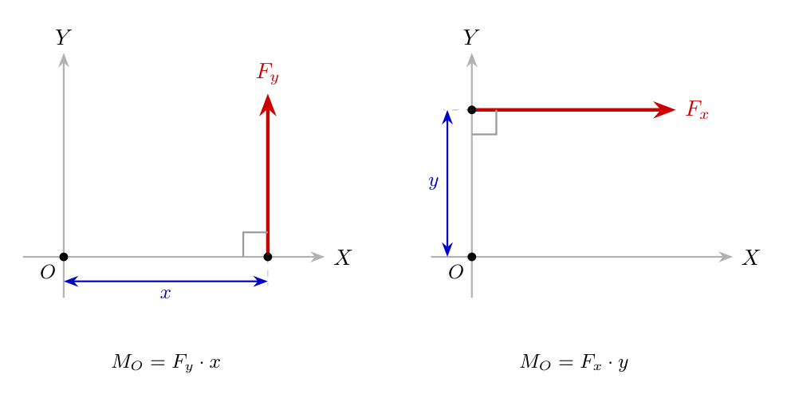
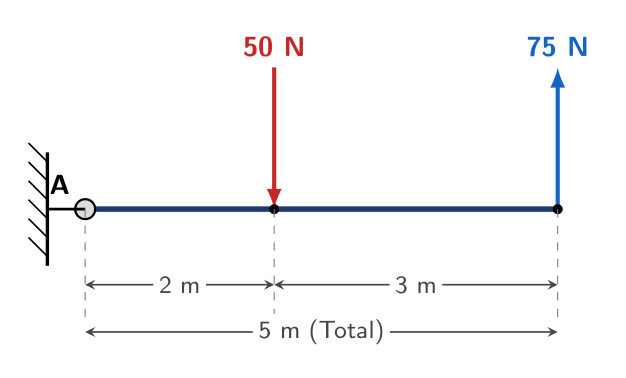
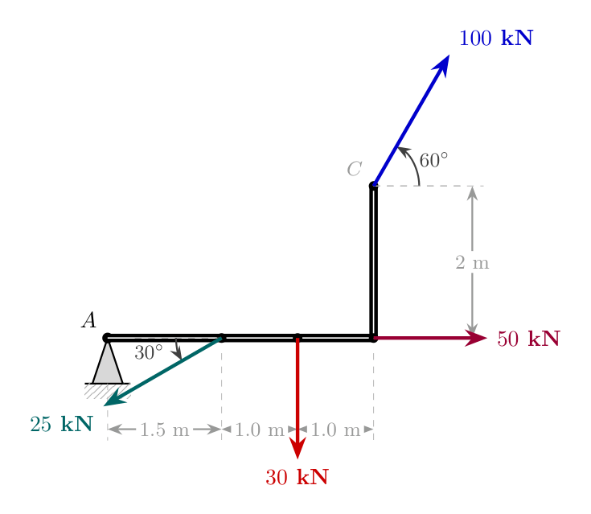
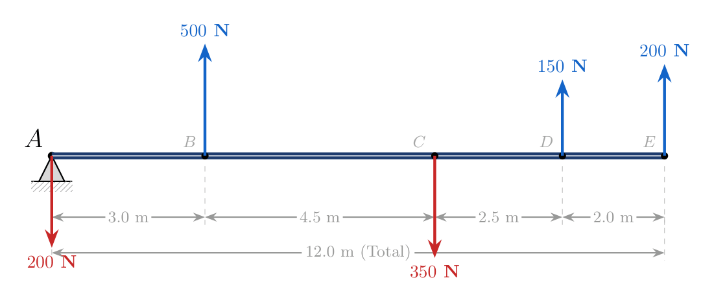
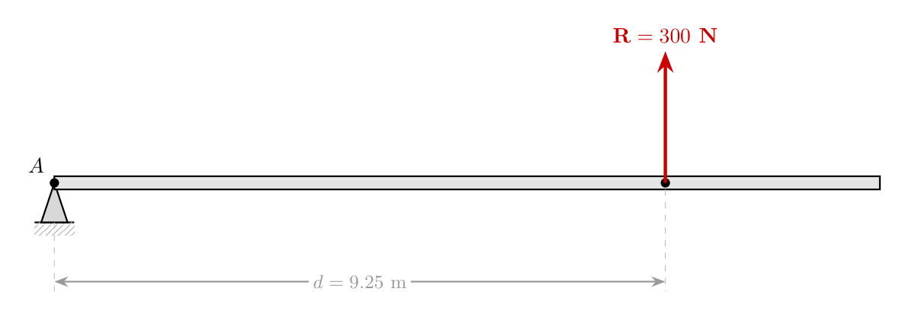

# Engineering Mechanics: Moment of a Force and Varignon's Theorem

---

## 1. High-Level Overview

### What is the Moment of a Force?
In physics and structural engineering, a force can push or pull an object in a straight line (translational motion). However, if an object is fixed or pivoted at a certain point, applying a force will cause it to **rotate** or **tend to rotate** about that point. 

The **Moment of a Force** (often simply called **Moment**, $M$) is the measure of the turning or rotational effect generated by a force acting on a body about a specific point (known as the *moment center*).

> **Intuitive Analogy:** Imagine opening a heavy door. Pushing near the hinges requires immense effort. Pushing far away from the hinges at the door handle makes it much easier to swing open. The force you apply is the same, but increasing the distance from the pivot point creates a much larger **moment** (rotational effect).

---

### Key Terminology
* **Moment Center (Pivot Point):** The fixed reference point about which the rotational effect of a force is evaluated.
* **Perpendicular Distance ($d$):** The exact shortest (90-degree) distance measured from the moment center to the line of action of the force.
* **Line of Action:** The infinite straight line along which a force vector acts.
* **Coplanar Force System:** A set of forces that all lie in the exact same two-dimensional plane.
* **Resultant Force ($R$):** A single equivalent force that produces the same overall translational effect as a set of multiple individual forces acting together.

---

## 2. Step-by-Step Fundamental Concepts

### Mathematical Formulation of Moment
The magnitude of a moment ($M$) created by a force ($F$) about a point is defined as the product of the magnitude of the force and the perpendicular distance ($d$) from the point to the line of action of the force:

$$M = F \times d$$

#### Standard Units:
* **SI Units:** $\text{N}\cdot\text{m}$ (Newton-meter) or $\text{kN}\cdot\text{m}$ (Kilonewton-meter).
* **Sub-multiples:** $\text{N}\cdot\text{mm}$ (Newton-millimeter).

---

### The Fundamental Rule: Force & Distance Axes
To calculate a moment correctly, the force direction and distance direction **MUST** be perpendicular to each other:

$$\text{If Force acts along the } Y\text{-axis (Vertical)} \implies \text{Distance must be along the } X\text{-axis (Horizontal)}$$

$$\text{If Force acts along the } X\text{-axis (Horizontal)} \implies \text{Distance must be along the } Y\text{-axis (Vertical)}$$

*Description of Diagram:* A 2D Cartesian coordinate frame showing a vertical force vector $F_y$ parallel to the $Y$-axis with a horizontal distance $x$ measured along the $X$-axis from origin $O$. Adjacent to it, a horizontal force vector $F_x$ parallel to the $X$-axis with a vertical distance $y$ measured along the $Y$-axis from origin $O$. Both form explicit $90^\circ$ right angles.

---

### Sign Convention for Moments
To combine moments algebraically, a consistent directional sign convention is required:

1. **Counter-Clockwise (CCW) Moment ($\curvearrowleft$):** Assigned a **Positive (+)** sign.
2. **Clockwise (CW) Moment ($\curvearrowright$):** Assigned a **Negative (-)** sign.

> **Determining Rotation Direction (The Circular Trace Method):**
> Imagine holding a pencil fixed at the moment center (e.g., Point $A$). Push the pencil in the direction of the force vector. Observe which way the beam rotates around Point $A$:
> * If it rotates counter-clockwise around $A \implies \text{Positive (+)}$.
> * If it rotates clockwise around $A \implies \text{Negative (-)}$.

---

### Resolving Inclined Forces into Components
When a force $F$ is applied at an angle $\theta$, it does not act purely along the $X$ or $Y$ axis. Break the force into rectangular components before calculating moments:

* **Horizontal Component:** $F_x = F \cos(\theta)$
* **Vertical Component:** $F_y = F \sin(\theta)$

Each component then produces its own separate moment using its corresponding perpendicular distance.

---

## 3. Varignon's Theorem (Principle of Moments)

### Statement of Theorem
> *"The algebraic sum of the moments of a system of coplanar forces about any point in their plane is equal to the moment of their resultant force about the same point."*

### Mathematical Expression

$$\sum M_A^F = M_A^R$$

$$\sum M_A^F = R \times d$$

Where:
* $\sum M_A^F$: Sum of moments of all individual forces about point $A$.
* $R$: Magnitude of the single resultant force ($R = \sum F_y$ for parallel vertical forces).
* $d$: Perpendicular distance from reference point $A$ to the line of action of the resultant force $R$.

### Practical Engineering Purpose
Varignon's Theorem allows us to replace a complicated system of many distributed parallel forces with a **single equivalent force** $R$ and locate **exactly where** ($d$) that single force must act to produce identical structural behavior.

---

## 4. Comprehensive Worked Examples

### Example 1: Basic Moment Calculation on a Simple Beam
**Problem Statement:** Calculate the net resultant moment about point $A$ ($\sum M_A$) for a beam subjected to a downward force of $50\text{ N}$ acting $2\text{ m}$ from $A$, and an upward force of $75\text{ N}$ acting at $5\text{ m}$ from $A$.

*Description of Diagram:* A horizontal line representing a beam anchored at left endpoint $A$. A downward force arrow of magnitude $50\text{ N}$ acts at a distance of $2\text{ m}$ to the right of $A$. An upward force arrow of magnitude $75\text{ N}$ acts at the right end of the beam, $3\text{ m}$ further right ($5\text{ m}$ total from $A$).

#### Step-by-Step Solution:

1. **Analyze individual force directions and rotational tendencies about $A$:**
   * **$50\text{ N}$ force (Downward at $2\text{ m}$):** Pushes down to the right of $A$, causing a Clockwise (CW) rotation $\implies$ **Negative (-)**.
     $$M_1 = -50\text{ N} \times 2\text{ m} = -100\text{ N}\cdot\text{m}$$

   * **$75\text{ N}$ force (Upward at $5\text{ m}$):** Pushes up to the right of $A$, causing a Counter-Clockwise (CCW) rotation $\implies$ **Positive (+)**.
     $$M_2 = +75\text{ N} \times (2\text{ m} + 3\text{ m}) = +75\text{ N} \times 5\text{ m} = +375\text{ N}\cdot\text{m}$$

2. **Sum the moments algebraically about Point $A$:**
   $$\sum M_A^F = (-50 \times 2) + (75 \times 5)$$
   $$\sum M_A^F = -100 + 375$$
   $$\mathbf{\sum M_A^F = 275\text{ N}\cdot\text{m} \quad (\text{Counter-Clockwise/Positive})}$$

---

### Example 2: Moments with Inclined Forces and Bent Beams
**Problem Statement:** Find the total moment about point $A$ ($\sum M_A$) for the structural member shown below.

*Description of Diagram:* A horizontal beam originating at point $A$. At $1.5\text{ m}$ from $A$, an inclined force of $25\text{ kN}$ acts downward and leftward at an angle of $30^\circ$ to the horizontal. At $2.5\text{ m}$ from $A$, a downward vertical force of $30\text{ kN}$ acts. At $3.5\text{ m}$ from $A$, a vertical column rises upwards by $2\text{ m}$. At the top of this vertical post, a force of $100\text{ kN}$ acts upward and rightward at an angle of $60^\circ$ to the horizontal line. A horizontal force of $50\text{ kN}$ acts rightward at the base of the vertical post.

#### Step-by-Step Solution:

1. **Resolve inclined forces into $X$ and $Y$ components:**

   * **$25\text{ kN}$ force at angle $30^\circ$:**
     * Vertical component: $F_{y1} = 25 \sin(30^\circ)\text{ kN}$ (acting downwards)
     * Horizontal component: $F_{x1} = 25 \cos(30^\circ)\text{ kN}$ (acting rightwards along the beam axis)

   * **$100\text{ kN}$ force at angle $60^\circ$ at top of vertical arm ($2\text{ m}$ above beam):**
     * Vertical component: $F_{y2} = 100 \sin(60^\circ)\text{ kN}$ (acting upwards)
     * Horizontal component: $F_{x2} = 100 \cos(60^\circ)\text{ kN}$ (acting rightwards)

2. **Evaluate the perpendicular distances and rotational effects for every force/component about point $A$:**

   * **Component $25 \sin(30^\circ)$ (Downward, distance $= 1.5\text{ m}$):**
     * Causes Clockwise rotation $\implies \mathbf{-}$
     * $M_1 = -25 \sin(30^\circ) \times 1.5$

   * **Component $25 \cos(30^\circ)$ (Horizontal through beam line):**
     * Passes directly through Point $A$ (distance $= 0\text{ m}$) $\implies \mathbf{0}$

   * **Force $30\text{ kN}$ (Downward, distance $= 1.5 + 1.0 = 2.5\text{ m}$):**
     * Causes Clockwise rotation $\implies \mathbf{-}$
     * $M_2 = -30 \times 2.5$

   * **Component $100 \cos(60^\circ)$ (Horizontal force at height of $2\text{ m}$):**
     * Pushes rightwards above $A$, causing Clockwise rotation $\implies \mathbf{-}$
     * Vertical perpendicular distance $= 2\text{ m}$
     * $M_3 = -100 \cos(60^\circ) \times 2$

   * **Component $100 \sin(60^\circ)$ (Upward force at horizontal distance $= 3.5\text{ m}$):**
     * Pushes upwards, causing Counter-Clockwise rotation $\implies \mathbf{+}$
     * Horizontal perpendicular distance $= 1.5 + 1.0 + 1.0 = 3.5\text{ m}$
     * $M_4 = +100 \sin(60^\circ) \times 3.5$

   * **Force $50\text{ kN}$ (Horizontal force at beam level):**
     * Line of action passes through Point $A$ (distance $= 0\text{ m}$) $\implies \mathbf{0}$

3. **Sum all moments algebraically:**
   $$\sum M_A = -25 \sin(30^\circ) \times 1.5 - 30 \times 2.5 - 100 \cos(60^\circ) \times 2 + 100 \sin(60^\circ) \times 3.5$$

4. **Substitute trigonometric values and calculate:**
   * $\sin(30^\circ) = 0.5 \implies -25(0.5) \times 1.5 = -18.75\text{ kN}\cdot\text{m}$
   * $-30 \times 2.5 = -75.0\text{ kN}\cdot\text{m}$
   * $\cos(60^\circ) = 0.5 \implies -100(0.5) \times 2 = -100.0\text{ kN}\cdot\text{m}$
   * $\sin(60^\circ) \approx 0.8660 \implies 100(0.8660) \times 3.5 = +303.10\text{ kN}\cdot\text{m}$

   $$\sum M_A = -18.75 - 75.0 - 100.0 + 303.10$$
   $$\mathbf{\sum M_A = 109.35\text{ kN}\cdot\text{m} \quad (\text{Counter-Clockwise/Positive})}$$

---

### Example 3: Finding Resultant and Location Using Varignon's Theorem
**Problem Statement:** A parallel system of vertical forces acts on a horizontal beam as shown:
* $200\text{ N}$ acting downward at Point $A$ ($0\text{ m}$)
* $500\text{ N}$ acting upward at $3.0\text{ m}$ from $A$
* $350\text{ N}$ acting downward at $7.5\text{ m}$ from $A$
* $150\text{ N}$ acting upward at $10.0\text{ m}$ from $A$
* $200\text{ N}$ acting upward at $12.0\text{ m}$ from $A$

Determine:
1. The magnitude and direction of the single Resultant Force ($R$).
2. The location distance ($d$) of the resultant force measured from point $A$.

*Description of Diagram:* A horizontal beam baseline marked with distances between force locations: Point $A$ at origin with $200\text{ N}$ arrow down; $3\text{ m}$ right to $500\text{ N}$ arrow up; $4.5\text{ m}$ further right ($7.5\text{ m}$ total) to $350\text{ N}$ arrow down; $2.5\text{ m}$ further right ($10\text{ m}$ total) to $150\text{ N}$ arrow up; $2\text{ m}$ further right ($12\text{ m}$ total) to $200\text{ N}$ arrow up.

#### Step-by-Step Solution:

#### Step 1: Calculate the Magnitude of the Resultant Force ($R$)
Since all forces are purely vertical ($\sum F_x = 0$):
$$R = \sum F_y$$

Taking upward forces as positive (+) and downward forces as negative (-):
$$\sum F_y = -200 + 500 - 350 + 150 + 200$$
$$\sum F_y = 300\text{ N}$$

$$\mathbf{R = 300\text{ N} \quad (\uparrow \text{ Acting Upwards})}$$

---

#### Step 2: Calculate the Algebraic Sum of Moments about Point $A$ ($\sum M_A^F$)
* **$200\text{ N}$ force at $A$ ($0\text{ m}$):** $M = -200 \times 0 = 0$
* **$500\text{ N}$ force at $3\text{ m}$ (Upward):** $M = +500 \times 3 = +1500\text{ N}\cdot\text{m}$
* **$350\text{ N}$ force at $7.5\text{ m}$ (Downward):** $M = -350 \times 7.5 = -2625\text{ N}\cdot\text{m}$
* **$150\text{ N}$ force at $10\text{ m}$ (Upward):** $M = +150 \times 10 = +1500\text{ N}\cdot\text{m}$
* **$200\text{ N}$ force at $12\text{ m}$ (Upward):** $M = +200 \times 12 = +2400\text{ N}\cdot\text{m}$

Summing together:
$$\mathbf{\sum M_A^F = 2775\text{ N}\cdot\text{m} \quad \left(\text{Counter-Clockwise}\right)}$$

---

#### Step 3: Apply Varignon's Theorem to Locate $R$
According to Varignon's Theorem:
$$\sum M_A^F = R \times d$$

Substitute the known values:
$$2775 = 300 \times d$$

$$d = \frac{2775}{300}$$

$$\mathbf{d = 9.25\text{ m}}$$

**Final Conclusion:** The entire 5-force system can be completely simplified into a single upward force of **$300\text{ N}$** applied at a position **$9.25\text{ m}$** to the right of point $A$.

*Description of Diagram:* A simplified beam model showing origin point $A$, a single upward vertical vector labeled $R = 300\text{ N}$ placed at a distance labeled $d = 9.25\text{ m}$ to the right of point $A$.

---

## 5. Summary Reference Table

| Parameter / Concept | Symbol | Formula / Rule | SI Unit |
| :--- | :--- | :--- | :--- |
| **Moment of Force** | $M$ | $M = F \times d$ | $\text{N}\cdot\text{m}$ or $\text{kN}\cdot\text{m}$ |
| **Horizontal Force Moment** | $M_x$ | $F_x \times y_{\text{perpendicular}}$ | $\text{N}\cdot\text{m}$ |
| **Vertical Force Moment** | $M_y$ | $F_y \times x_{\text{perpendicular}}$ | $\text{N}\cdot\text{m}$ |
| **Counter-Clockwise Rotation** | $\circlearrowleft$ | Positive sign ($+$) | N/A |
| **Clockwise Rotation** | $\circlearrowright$ | Negative sign ($-$) | N/A |
| **Varignon's Theorem** | — | $\sum M_A^F = R \times d$ | N/A |