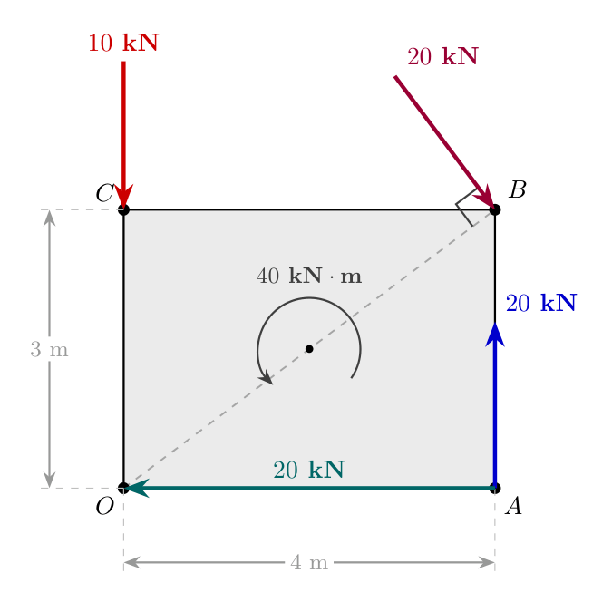

# Resultant of Coplanar Non-Concurrent Force Systems

## High-Level Overview

In Statics and Engineering Mechanics, a **force system** consists of multiple forces and/or moments acting simultaneously on a body. When these forces act in a single 2D plane, they are called **coplanar**. If their lines of action do not all intersect at a single point, they form a **coplanar non-concurrent force system**.

To analyze the combined effect of such a system, we reduce all forces and moments into a single equivalent force called the **Resultant Force ($R$)**, acting at a specific line of action (or perpendicular distance $d$) relative to a given reference point (such as the origin or base $O$).

### Fundamental Terminology
* **Force Vector ($\mathbf{F}$):** A quantity having both magnitude and direction, measured in Newtons ($\text{N}$) or Kilonewtons ($\text{kN}$).
* **Moment ($M$):** The rotational effect produced by a force about a specific point, measured in Newton-meters ($\text{N}\cdot\text{m}$) or Kilonewton-meters ($\text{kN}\cdot\text{m}$). 
  $$\text{Moment} = \text{Force} \times \text{Perpendicular Distance}$$
* **Resultant Force ($R$):** A single force that produces the exact same translational effect as the combined system of original forces.
* **Varignon's Theorem (Principle of Moments):** The algebraic sum of moments produced by individual forces about any point is equal to the moment produced by their single resultant force about that same point.

---

## Step-by-Step Analytical Breakdown

To determine the resultant force and its point/distance of application for a coplanar force system, follow this standardized procedure:

### 1. Vector Resolution of Forces
Decompose every inclined force acting at an angle $\theta$ into horizontal ($x$) and vertical ($y$) components:
* Horizontal component: $F_x = F \cos\theta$
* Vertical component: $F_y = F \sin\theta$

**Sign Conventions:**
* Rightward forces ($\rightarrow$) are positive ($+$); leftward forces ($\leftarrow$) are negative ($-$).
* Upward forces ($\uparrow$) are positive ($+$); downward forces ($\downarrow$) are negative ($-$).

### 2. Summation of Force Components
Calculate the algebraic sum of all horizontal and vertical forces:
$$\Sigma F_x = \text{Sum of all horizontal force components}$$
$$\Sigma F_y = \text{Sum of all vertical force components}$$

### 3. Magnitude and Angle of Resultant
The total magnitude $R$ of the resultant force is found using the Pythagorean theorem:
$$R = \sqrt{(\Sigma F_x)^2 + (\Sigma F_y)^2}$$

The angle $\theta$ that the resultant makes with the horizontal axis is given by:
$$\theta = \tan^{-1}\left( \left| \frac{\Sigma F_y}{\Sigma F_x} \right| \right)$$

### 4. Moment Summation & Application of Varignon's Theorem
Choose a reference point (e.g., origin $O$ or point $A$). Compute the net moment $\Sigma M_O^F$ exerted by all individual forces and explicit moment couples about that point:

**Sign Conventions for Moments:**
* Counter-Clockwise (CCW) moment = Positive ($+$)
* Clockwise (CW) moment = Negative ($-$)

Apply Varignon's Theorem to find the perpendicular distance $d$ from the reference point to the line of action of $R$:
$$\Sigma M_O^F = R \times d \implies d = \frac{|\Sigma M_O^F|}{R}$$

---

## Worked Examples

### Problem 1: Rectangular Body $OABC$ Under Multiple Forces and a Couple Moment

#### Problem Statement
Find the resultant of the force system acting on a body $OABC$ shown in the schematic. Determine the perpendicular distance of the resultant from point $O$.
* Dimensions: Width $OA = BC = 4\,\text{m}$, Height $OC = AB = 3\,\text{m}$.
* Point $O$ is located at $(0,0)$.
* Point $A$ is located at $(4,0)$.
* Point $B$ is located at $(4,3)$.
* Point $C$ is located at $(0,3)$.
* Applied Forces/Moments:
  1. A downward force of $10\,\text{kN}$ at point $C$.
  2. An upward force of $20\,\text{kN}$ at point $A$.
  3. A leftward force of $20\,\text{kN}$ along segment $OA$ at point $O$.
  4. An inclined force of $20\,\text{kN}$ acting inward at vertex $B$, perpendicular to diagonal $OB$.
  5. A counter-clockwise couple moment of $40\,\text{kN}\cdot\text{m}$ at the center.

> **Visual Description:** A rectangular body $OABC$ in the first quadrant of a Cartesian plane. Corner $O$ is at $(0,0)$, $A$ at $(4,0)$, $B$ at $(4,3)$, and $C$ at $(0,3)$. Diagonal $OB$ is shown as a dashed line. A $20\,\text{kN}$ vertical force acts upwards at $A$. A $20\,\text{kN}$ horizontal force acts leftwards along $OA$ towards $O$. A $10\,\text{kN}$ vertical force acts downwards at $C$. A $20\,\text{kN}$ force acts at $B$, oriented perpendicular to diagonal $OB$. A counter-clockwise arc represents a $40\,\text{kN}\cdot\text{m}$ moment at the center.

---

#### Detailed Solution

##### Step 1: Geometric Analysis of Diagonal $OB$
The angle $\theta_1$ made by diagonal $OB$ with the horizontal line $OA$ is:
$$\tan\theta_1 = \frac{\text{Height}}{\text{Width}} = \frac{3}{4}$$
$$\theta_1 = \tan^{-1}\left(\frac{3}{4}\right) = 36.869^\circ$$

Since the $20\,\text{kN}$ force applied at point $B$ is perpendicular to diagonal $OB$, the angle $\theta_2$ that this force makes with the horizontal line is:
$$\theta_2 = 90^\circ - \theta_1 = 90^\circ - 36.869^\circ = 53.13^\circ$$

Resolving the $20\,\text{kN}$ force at point $B$:
* Horizontal component (rightward): $20 \cos(53.13^\circ) \approx 12\,\text{kN}$
* Vertical component (downward): $20 \sin(53.13^\circ) \approx 16\,\text{kN}$

##### Step 2: Summation of Forces
Summing horizontal forces along the $x$-axis:
$$\Sigma F_x = -20 + 20 \cos(53.13^\circ)$$
$$\Sigma F_x = -20 + 12 = -8\,\text{kN}$$
Therefore, $\Sigma F_x = 8\,\text{kN} \quad (\leftarrow)$

Summing vertical forces along the $y$-axis:
$$\Sigma F_y = 20 - 10 - 20 \sin(53.13^\circ)$$
$$\Sigma F_y = 20 - 10 - 16 = -6\,\text{kN}$$
Therefore, $\Sigma F_y = 6\,\text{kN} \quad (\downarrow)$

##### Step 3: Resultant Magnitude and Direction
Magnitude:
$$R = \sqrt{(\Sigma F_x)^2 + (\Sigma F_y)^2} = \sqrt{(-8)^2 + (-6)^2} = \sqrt{64 + 36} = \sqrt{100} = 10\,\text{kN}$$

Direction relative to the horizontal:
$$\theta = \tan^{-1}\left( \left| \frac{\Sigma F_y}{\Sigma F_x} \right| \right) = \tan^{-1}\left(\frac{6}{8}\right) = 36.869^\circ$$
The resultant $R$ acts at an angle of $36.869^\circ$ pointing into the third quadrant (downward and leftward).

##### Step 4: Net Moment About Point $O$
Taking counter-clockwise moments as positive ($+$):
1. $20\,\text{kN}$ force at $A$ (upward): Distance $= 4\,\text{m}$, Moment $= + (20 \times 4) = +80\,\text{kN}\cdot\text{m}$ (CCW)
2. $10\,\text{kN}$ force at $C$ (downward): Passes through vertical line $OC$ ($d = 0\,\text{m}$), Moment $= 0$
3. $20\,\text{kN}$ force at $O$ (leftward): Line of action passes directly through point $O$, Moment $= 0$
4. Components of $20\,\text{kN}$ force at $B$:
   * Horizontal component $20 \cos(53.13^\circ)$ (rightward) at height $y = 3\,\text{m}$: Moment $= - (20 \cos(53.13^\circ) \times 3) = - (12 \times 3) = -36\,\text{kN}\cdot\text{m}$ (CW)
   * Vertical component $20 \sin(53.13^\circ)$ (downward) at distance $x = 4\,\text{m}$: Moment $= - (20 \sin(53.13^\circ) \times 4) = - (16 \times 4) = -64\,\text{kN}\cdot\text{m}$ (CW)
5. Pure couple moment applied at center: $+40\,\text{kN}\cdot\text{m}$ (CCW)

Summing all moments about point $O$:
$$\Sigma M_O^F = +80 - 36 - 64 + 40 = 20\,\text{kN}\cdot\text{m} \quad (\text{Counter-Clockwise})$$

##### Step 5: Perpendicular Distance from Point $O$
Using Varignon's Theorem:
$$\Sigma M_O^F = R \times d$$
$$20 = 10 \times d \implies d = 2\,\text{m}$$

The line of action of the resultant force $R = 10\,\text{kN}$ is located at a perpendicular distance $d = 2\,\text{m}$ from origin $O$.

---

### Problem 2: Vertical Frame/Pole Subjected to Inclined and Point Forces

#### Problem Statement
Three forces act on a vertical pole of total height $6\,\text{m}$ fixed at base $A$:
1. A horizontal force of $1\,\text{kN}$ acting leftward at height $y = 3\,\text{m}$.
2. An inclined force of $3\,\text{kN}$ acting at the top of the pole ($y = 6\,\text{m}$) at an angle of $30^\circ$ below the horizontal pointing downward-leftward.
3. A downward vertical force of $2.5\,\text{kN}$ acting at the tip of a horizontal bracket extending $1.5\,\text{m}$ to the right, attached at height $y = 5\,\text{m}$.

Find the magnitude, direction, and line of action of the resultant force with respect to base $A$.

> **Visual Description:** A vertical pole attached to a fixed base at $A$. At top height $6\,\text{m}$, an inclined $3\,\text{kN}$ force acts downwards and leftwards at $30^\circ$ below horizontal. A horizontal cantilever bracket extends $1.5\,\text{m}$ rightwards at height $5\,\text{m}$, carrying a $2.5\,\text{kN}$ vertical downward force at its end. A horizontal leftward force of $1\,\text{kN}$ acts directly on the main vertical pole at height $3\,\text{m}$.

---

#### Detailed Solution

##### Step 1: Resolving Inclined Forces
The $3\,\text{kN}$ force at the top ($y = 6\,\text{m}$) is resolved into:
* Horizontal component (leftward): $3 \cos(30^\circ) \approx 2.598\,\text{kN}$
* Vertical component (downward): $3 \sin(30^\circ) = 1.5\,\text{kN}$

##### Step 2: Summation of Forces
Sum of horizontal forces ($\Sigma F_x$):
$$\Sigma F_x = -1 - 3 \cos(30^\circ) = -1 - 2.598 = -3.598\,\text{kN}$$
Therefore, $\Sigma F_x = 3.598\,\text{kN} \quad (\leftarrow)$

Sum of vertical forces ($\Sigma F_y$):
$$\Sigma F_y = -2.5 - 3 \sin(30^\circ) = -2.5 - 1.5 = -4.000\,\text{kN}$$
Therefore, $\Sigma F_y = 4\,\text{kN} \quad (\downarrow)$

##### Step 3: Resultant Magnitude and Direction
Magnitude:
$$R = \sqrt{(\Sigma F_x)^2 + (\Sigma F_y)^2} = \sqrt{(-3.598)^2 + (-4)^2} = \sqrt{12.946 + 16} = \sqrt{28.946} \approx 5.38\,\text{kN}$$

Orientation angle $\theta$:
$$\theta = \tan^{-1}\left( \frac{|\Sigma F_y|}{|\Sigma F_x|} \right) = \tan^{-1}\left( \frac{4}{3.598} \right) \approx 48.03^\circ \quad (\text{below horizontal})$$

##### Step 4: Moment Summation About Base Point $A$
1. $1\,\text{kN}$ horizontal force at $y = 3\,\text{m}$ (leftward): 
   $$\text{Moment} = + (1 \times 3) = +3\,\text{kN}\cdot\text{m} \quad (\text{CCW})$$
2. $2.5\,\text{kN}$ vertical force at horizontal distance $x = 1.5\,\text{m}$ (downward): 
   $$\text{Moment} = - (2.5 \times 1.5) = -3.75\,\text{kN}\cdot\text{m} \quad (\text{CW})$$
3. $3\,\text{kN}$ inclined force components at $y = 6\,\text{m}$:
   * Horizontal component $3 \cos(30^\circ)$ (leftward) at height $y = 6\,\text{m}$: 
     $$\text{Moment} = + (3 \cos(30^\circ) \times 6) = + (2.598 \times 6) = +15.588\,\text{kN}\cdot\text{m} \quad (\text{CCW})$$
   * Vertical component $3 \sin(30^\circ)$ acts along the centerline of the pole ($x = 0\,\text{m}$): 
     $$\text{Moment} = 0$$

Net Moment about $A$:
$$\Sigma M_A^F = +3 - 3.75 + 15.588 = +14.838\,\text{kN}\cdot\text{m} \quad (\text{Counter-Clockwise})$$

##### Step 5: Perpendicular Distance from $A$
$$d = \frac{|\Sigma M_A^F|}{R} = \frac{14.838}{5.38} \approx 2.76\,\text{m}$$

---

## Summary Equations Reference Table

| Parameter | Formula | Description |
| :--- | :--- | :--- |
| **Horizontal Force Sum** | $\Sigma F_x = \sum F_i \cos\theta_i$ | Vector sum of all $x$-components |
| **Vertical Force Sum** | $\Sigma F_y = \sum F_i \sin\theta_i$ | Vector sum of all $y$-components |
| **Resultant Magnitude** | $R = \sqrt{(\Sigma F_x)^2 + (\Sigma F_y)^2}$ | Magnitude of net combined force |
| **Resultant Angle** | $\theta = \tan^{-1}\left\|\frac{\Sigma F_y}{\Sigma F_x}\right\|$ | Angle relative to horizontal axis |
| **Varignon's Principle** | $\Sigma M_O = R \times d$ | Equates net component moments to total resultant moment |
| **Line of Action Offset** | $d = \frac{\|\Sigma M_O\|}{R}$ | Perpendicular distance from reference point |