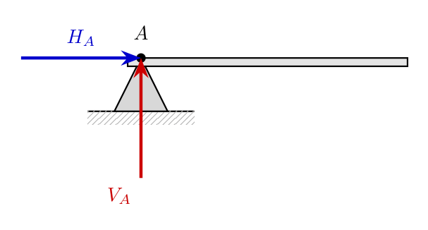
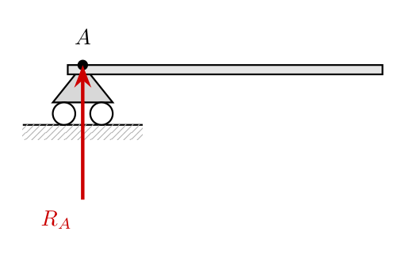
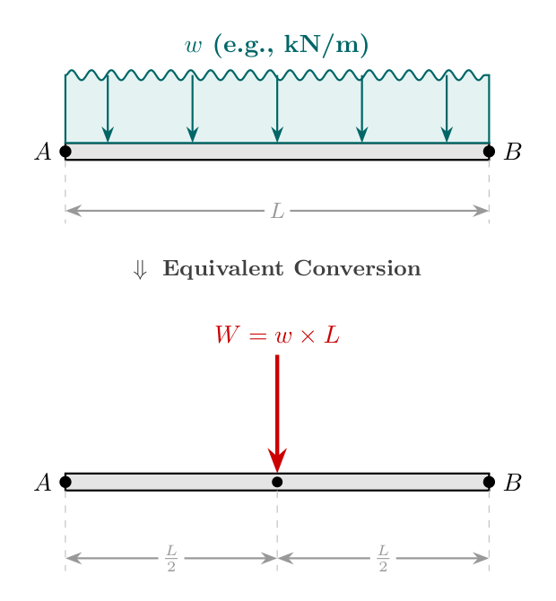
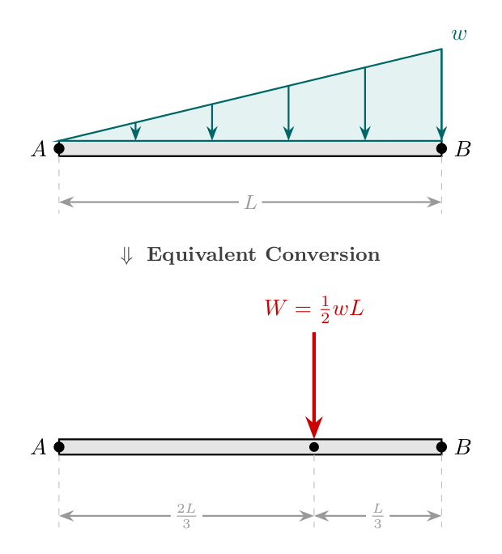
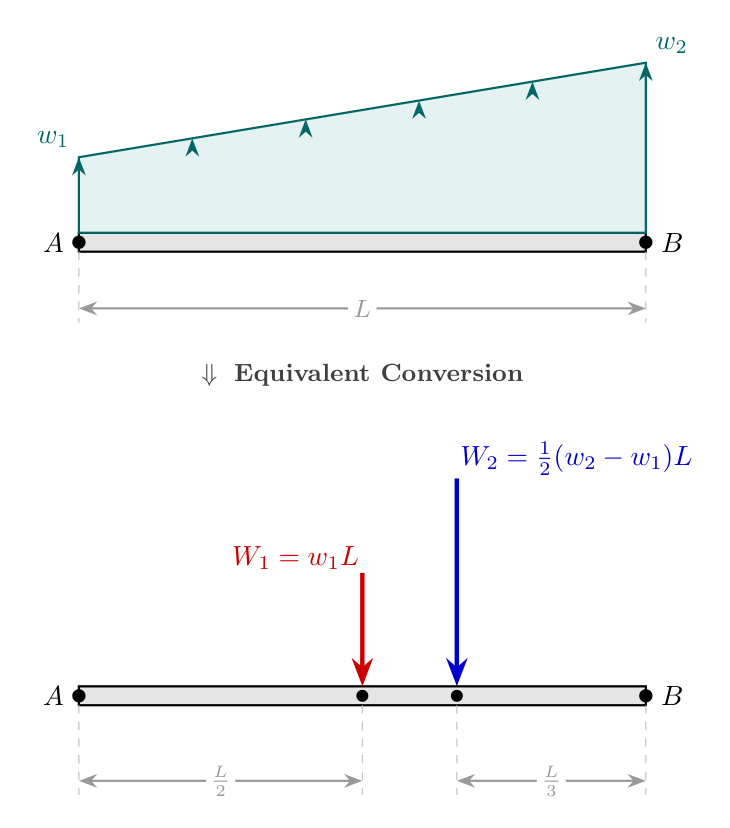
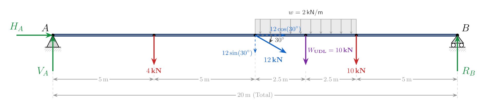
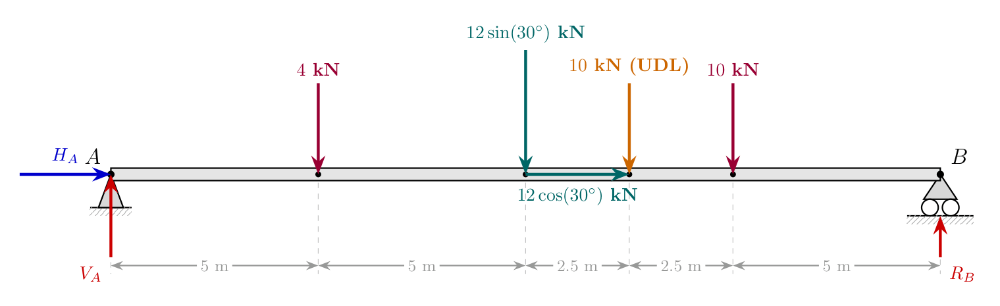

# Equilibrium of Rigid Bodies and Beam Analysis

## High-Level Overview

In Engineering Mechanics, **equilibrium** is the state of a rigid body in which all surrounding forces and moments are perfectly balanced. When a body is in equilibrium, it experiences zero acceleration, meaning it either remains completely at rest (static equilibrium) or moves at a constant velocity (dynamic equilibrium).

To maintain equilibrium, a structural member (such as a beam) must be supported by physical constraints—known as **supports**—that exert **support reactions** to counteract external **loads**. Analyzing these loads, replacing distributed forces with equivalent point loads, and setting up static equilibrium equations allows engineers to determine the internal and external forces maintaining structural integrity.

---

## Conditions of Static Equilibrium

For a coplanar (2D) system of forces acting on a rigid body, the resultant force $R$ and net moment $M$ must equal zero. This yields three fundamental scalar equations of static equilibrium:

1. **Horizontal Force Balance:**
   $$\Sigma F_x = 0$$
   *(The sum of all rightward forces equals the sum of all leftward forces.)*

2. **Vertical Force Balance:**
   $$\Sigma F_y = 0$$
   *(The sum of all upward forces equals the sum of all downward forces.)*

3. **Moment Balance:**
   $$\Sigma M = 0$$
   *(The sum of all counter-clockwise moments about any point equals the sum of all clockwise moments about that same point.)*

---

## Types of Supports and Support Reactions

Supports prevent specific linear displacements and rotational movements. Every constrained motion generates a corresponding **reaction force or moment**.

### 1. Hinge (Pin) Support
* **Motion Restricted:** Prevents horizontal and vertical translation. Allows rotation.
* **Reactions Generated:** Two linear reaction components:
  * Horizontal reaction force ($H_A$)
  * Vertical reaction force ($V_A$)

> **Visual Description:** A horizontal beam resting on a pin/hinge support at end point $A$. The hinge support exerts two independent force components on the beam: a horizontal force vector $H_A$ pointing rightward and a vertical force vector $V_A$ pointing upward.

### 2. Roller Support
* **Motion Restricted:** Prevents movement perpendicular to the supporting surface. Allows movement parallel to the surface and allows rotation.
* **Reactions Generated:** One single reaction force ($R_A$) acting normal (perpendicular) to the supporting contact surface.

> **Visual Description:** A horizontal beam supported at end $A$ by a roller assembly resting on a flat surface. The roller exerts a single vertical reaction force vector $R_A$ directed perpendicular to the surface upwards into the beam.

---

## Types of Applied Structural Loads

Distributed loads act along a continuous length of a structural member rather than at a single discrete point. For calculation purposes, every distributed load is replaced by an **equivalent point load** equal to its area, applied at its **centroid** (center of gravity).

### 1. Uniformly Distributed Load (UDL)
A UDL spreads an equal amount of load per unit length across a span.
* **Intensity:** $w$ (e.g., $\text{kN/m}$)
* **Span Length:** $L$
* **Equivalent Point Load ($W$):**
  $$W = w \times L$$
* **Point of Application:** At the midpoint of the span ($\frac{L}{2}$ from either end).

> **Visual Description:** Top diagram shows a continuous wave pattern across span length $L$ representing a UDL of intensity $w$. Bottom diagram shows the equivalent point load of magnitude $W = w \times L$ acting vertically downward at a distance $\frac{L}{2}$ from either end.

---

### 2. Uniformly Varying Load (UVL)
A UVL varies linearly from zero intensity at one end to a peak intensity $w$ at the other (triangular shape).
* **Peak Intensity:** $w$ (e.g., $\text{kN/m}$)
* **Span Length:** $L$
* **Equivalent Point Load ($W$):** Equal to the area of the triangular distribution:
  $$W = \frac{1}{2} \times w \times L$$
* **Point of Application:** Located at the centroid of the triangle:
  * $\frac{L}{3}$ from the larger (peak) side.
  * $\frac{2L}{3}$ from the vertex (zero load) side.

> **Visual Description:** Top diagram displays a right-triangular load distribution along span $L$, starting at zero at point $A$ and reaching maximum intensity $w$ at point $B$. Bottom diagram shows the equivalent concentrated load $W = \frac{1}{2} w L$ acting downwards at a distance $\frac{L}{3}$ from the maximum load edge $B$.

---

### 3. Trapezoidal Load
A trapezoidal load varies linearly between two non-zero intensity values ($w_1$ and $w_2$). It is solved by breaking it into two simpler shapes: a rectangular UDL and a triangular UVL.

* **Components:**
  1. **Rectangular Part (UDL):** Intensity $w_1$ over length $L$.
     * Equivalent Load: $W_1 = w_1 \times L$, applied at distance $\frac{L}{2}$ from end $A$.
  2. **Triangular Part (UVL):** Intensity $(w_2 - w_1)$ over length $L$.
     * Equivalent Load: $W_2 = \frac{1}{2} \times (w_2 - w_1) \times L$, applied at distance $\frac{L}{3}$ from end $B$.

> **Visual Description:** Top diagram displays a trapezoidal load starting at intensity $w_1$ at end $A$ and rising to $w_2$ at end $B$ over span $L$. Bottom diagram shows its resolution into two equivalent concentrated forces: rectangular force $W_1 = w_1 L$ acting at $\frac{L}{2}$ and triangular force $W_2 = \frac{1}{2}(w_2 - w_1)L$ acting at distance $\frac{L}{3}$ from $B$.

---

## Worked Example: Calculating Beam Support Reactions

### Problem Statement
A horizontal beam $AB$ of total length $20\,\text{m}$ is hinged at end $A$ and supported on rollers at end $B$. The beam is subjected to the following loading configuration:
1. A vertical point load of $4\,\text{kN}$ downward at $5\,\text{m}$ from $A$.
2. An inclined force of $12\,\text{kN}$ pointing downward and rightward at an angle of $30^\circ$ to the horizontal beam at $10\,\text{m}$ from $A$.
3. A Uniformly Distributed Load (UDL) of intensity $2\,\text{kN/m}$ spanning a length of $5\,\text{m}$ (between $10\,\text{m}$ and $15\,\text{m}$ from $A$).
4. A vertical point load of $10\,\text{kN}$ downward at $15\,\text{m}$ from $A$.

Find the support reactions at ends $A$ and $B$.

> **Visual Description:** Free Body Diagram of beam $AB$ ($20\,\text{m}$ long). Hinge reactions $H_A$ (rightward) and $V_A$ (upward) act at $A$. Roller reaction $R_B$ (upward) acts at $B$. Moving rightward: a $4\,\text{kN}$ downward force at $5\,\text{m}$; an inclined force resolved into $12\cos(30^\circ)$ rightward and $12\sin(30^\circ)$ downward at $10\,\text{m}$; an equivalent $10\,\text{kN}$ vertical downward force (from UDL) acting at $12.5\,\text{m}$; a $10\,\text{kN}$ point load at $15\,\text{m}$.

---

### Detailed Step-by-Step Solution

#### Step 1: Resolve the Inclined Force
The $12\,\text{kN}$ force at an angle of $30^\circ$ to the horizontal is resolved into components:
* Horizontal component (rightward): 
  $$12 \cos(30^\circ) = 12 \times 0.8660 = 10.392\,\text{kN} \quad (\rightarrow)$$
* Vertical component (downward): 
  $$12 \sin(30^\circ) = 12 \times 0.5 = 6\,\text{kN} \quad (\downarrow)$$

#### Step 2: Convert the UDL into an Equivalent Point Load
* Intensity $w = 2\,\text{kN/m}$, Span $L_{\text{UDL}} = 5\,\text{m}$
* Magnitude of equivalent point load: 
  $$W_{\text{UDL}} = 2\,\text{kN/m} \times 5\,\text{m} = 10\,\text{kN} \quad (\downarrow)$$
* Location: Midpoint of the UDL span:
  $$\text{Distance from } A = 10\,\text{m} + \frac{5\,\text{m}}{2} = 12.5\,\text{m}$$

#### Step 3: Apply the Equilibrium Equation $\Sigma F_x = 0$
Summing all horizontal forces acting on the beam:
$$H_A + 12 \cos(30^\circ) = 0$$
$$H_A + 10.392 = 0 \implies H_A = -10.392\,\text{kN}$$

*(The negative sign indicates that horizontal reaction force $H_A$ acts leftward $\leftarrow$, opposite to the initially assumed direction.)*

$$\mathbf{H_A = 10.392\,\text{kN} \quad (\leftarrow)}$$

---

#### Step 4: Apply Moment Equilibrium $\Sigma M_A = 0$
Taking moments about hinge point $A$, setting counter-clockwise (CCW) moments as positive ($+$) and clockwise (CW) moments as negative ($-$):

1. **$4\,\text{kN}$ Point Load:** 
   $$\text{Moment} = - (4 \times 5) = -20\,\text{kN}\cdot\text{m}$$
2. **Vertical Component of $12\,\text{kN}$ Force ($12\sin 30^\circ = 6\,\text{kN}$):** 
   $$\text{Moment} = - (12 \sin 30^\circ \times 10) = - (6 \times 10) = -60\,\text{kN}\cdot\text{m}$$
3. **Horizontal Component of $12\,\text{kN}$ Force ($12\cos 30^\circ$):** 
   $$\text{Passes through point } A \implies \text{Moment} = 0$$
4. **Equivalent Point Load of UDL ($10\,\text{kN}$):** 
   $$\text{Moment} = - (10 \times 12.5) = -125\,\text{kN}\cdot\text{m}$$
5. **$10\,\text{kN}$ Point Load:** 
   $$\text{Moment} = - (10 \times 15) = -150\,\text{kN}\cdot\text{m}$$
6. **Roller Support Reaction $R_B$ (Upward at $20\,\text{m}$):** 
   $$\text{Moment} = + (R_B \times 20)$$

Summing moments about $A$:
$$\Sigma M_A = -(4 \times 5) - (12 \sin 30^\circ \times 10) - (10 \times 12.5) - (10 \times 15) + (R_B \times 20) = 0$$

$$-20 - 60 - 125 - 150 + 20 R_B = 0$$
$$-355 + 20 R_B = 0$$
$$20 R_B = 355$$
$$\mathbf{R_B = 17.75\,\text{kN} \quad (\uparrow)}$$

---

#### Step 5: Apply the Equilibrium Equation $\Sigma F_y = 0$
Summing all vertical forces acting on the beam:
$$V_A - 4 - 12 \sin(30^\circ) - 10_{\text{UDL}} - 10 + R_B = 0$$
$$V_A - 4 - 6 - 10 - 10 + 17.75 = 0$$
$$V_A - 30 + 17.75 = 0$$
$$V_A - 12.25 = 0$$
$$\mathbf{V_A = 12.25\,\text{kN} \quad (\uparrow)}$$

---

## Load & Support Reaction Summary Table

| Support / Load Type | Primary Motion / Distribution Characteristics | Equivalent Point Load | Centroidal Location | Reaction Forces |
| :--- | :--- | :--- | :--- | :--- |
| **Hinge Support** | Restrains $x$ and $y$ linear translations | N/A | N/A | $H_A$ (Horizontal), $V_A$ (Vertical) |
| **Roller Support** | Restrains normal linear translation | N/A | N/A | $R_A$ (Normal to contact surface) |
| **UDL** | Uniform intensity $w$ across span $L$ | $W = w \cdot L$ | $\frac{L}{2}$ from end | N/A |
| **UVL** | Linear intensity variation $0 \to w$ across $L$ | $W = \frac{1}{2} w L$ | $\frac{L}{3}$ from peak side | N/A |
| **Trapezoidal Load** | Linear intensity variation $w_1 \to w_2$ across $L$ | $W_1 = w_1 L$, $W_2 = \frac{1}{2}(w_2-w_1)L$ | $\frac{L}{2}$ for UDL part, $\frac{L}{3}$ for UVL part | N/A |