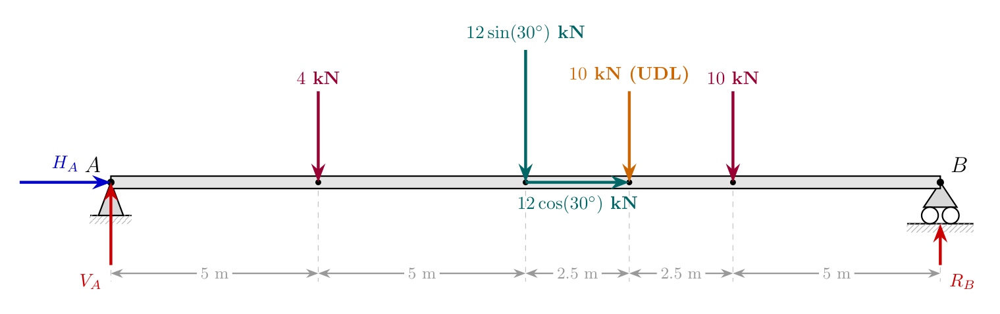
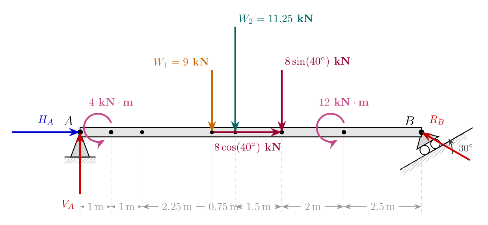

# Equilibrium Analysis of Beams: Support Reactions & Combined Loads

## High-Level Overview

In structural engineering, determining **support reactions** is the foundational step in analyzing any loaded beam. When external forces, distributed loads (UDLs/UVLs), inclined point loads, and pure moment couples act on a beam, the supports must exert equal and opposite reactions to maintain **static equilibrium**.

To evaluate complex beam systems:
1. **Support Conditions** dictate the types and directions of unknown reaction forces:
   * **Hinge (Pin) Support:** Exerts horizontal ($H_A$) and vertical ($V_A$) reaction forces.
   * **Roller Support on Inclined Plane:** Exerts a single normal reaction force $R$ perpendicular to the inclined plane angle $\alpha$. The reaction vector thus acts at an angle $\theta = 90^\circ - \alpha$ relative to the beam line.
2. **Distributed Loads** must be converted into single equivalent concentrated forces acting at their specific centroids.
3. **Equilibrium Equations** ($\Sigma F_x = 0$, $\Sigma F_y = 0$, and $\Sigma M = 0$) are applied systematically to solve for all unknown reactions.

---

## Analytical Breakdown of Support & Load Handling

### 1. Roller Support on an Inclined Surface
When a roller support rests on a plane inclined at an angle $\alpha$ to the horizontal:
* The reaction force vector $R$ acts perpendicular to the inclined plane.
* Angle of reaction vector relative to horizontal: $\theta = 90^\circ - \alpha$.
* Resolution into components:
  * Horizontal component: $R_x = R \cos(90^\circ - \alpha)$
  * Vertical component: $R_y = R \sin(90^\circ - \alpha)$

For example, if the inclined plane angle is $\alpha = 30^\circ$, the normal reaction vector makes an angle of $60^\circ$ ($90^\circ - 30^\circ$) relative to the horizontal beam axis:
* $R_x = R \cos 60^\circ$
* $R_y = R \sin 60^\circ$

---

### 2. Resolving Trapezoidal Load Distributions
A trapezoidal load varying from intensity $w_1$ to $w_2$ across span length $L$ can be split into two basic geometry components:

$$\text{Trapezoidal Load} = \text{Rectangular UDL } (w_1 \times L) + \text{Triangular UVL } \left(\frac{1}{2} \times (w_2 - w_1) \times L\right)$$

* **Rectangular Load Component ($W_1$):**
  $$W_1 = w_1 \times L \quad \text{acting at distance } \frac{L}{2} \text{ from the start of the load}$$
* **Triangular Load Component ($W_2$):**
  $$W_2 = \frac{1}{2} \times (w_2 - w_1) \times L \quad \text{acting at distance } \frac{1}{3}L \text{ from the peak side (or } \frac{2}{3}L \text{ from the start)}$$

---

## Worked Examples

### Problem 1: Simply Supported Beam with Point Loads, Inclined Force, and UDL

#### Problem Statement
A beam $AB$ is hinged at end $A$ and roller supported at end $B$. It is subjected to the following loads:
1. A vertical point load of $4\,\text{kN}$ downward at $5\,\text{m}$ from $A$.
2. An inclined force of $12\,\text{kN}$ acting downward-rightward at $30^\circ$ to the horizontal, applied at $10\,\text{m}$ from $A$.
3. A UDL of intensity $2\,\text{kN/m}$ spanning $5\,\text{m}$ (between $10\,\text{m}$ and $15\,\text{m}$ from $A$).
4. A vertical point load of $10\,\text{kN}$ downward at $15\,\text{m}$ from $A$.
5. Total beam length between $A$ and $B = 20\,\text{m}$.

Find the support reactions at $A$ and $B$.

> **Visual Description:** Free body diagram of horizontal beam $AB$ ($20\,\text{m}$ long). Hinge support at $A$ with horizontal reaction $H_A$ and vertical reaction $V_A$. Roller support at $B$ with upward reaction $R_B$. Loads applied from left to right: $4\,\text{kN}$ downward force at $5\,\text{m}$; inclined load at $10\,\text{m}$ resolved into horizontal $12\cos 30^\circ$ and vertical $12\sin 30^\circ$; equivalent UDL force $10\,\text{kN}$ downward at $12.5\,\text{m}$; vertical point load $10\,\text{kN}$ downward at $15\,\text{m}$.

---

#### Step-by-Step Solution

##### Step 1: Force Resolution & Equivalent Loads
* **Inclined Force Components ($12\,\text{kN}$ at $30^\circ$):**
  * Horizontal component: $12 \cos 30^\circ \approx 10.392\,\text{kN} \quad (\rightarrow)$
  * Vertical component: $12 \sin 30^\circ = 6\,\text{kN} \quad (\downarrow)$
* **UDL Equivalent Point Load ($2\,\text{kN/m}$ over $5\,\text{m}$):**
  * Magnitude: $W_{\text{UDL}} = 2 \times 5 = 10\,\text{kN}$
  * Location from $A$: $10\,\text{m} + 2.5\,\text{m} = 12.5\,\text{m}$

##### Step 2: Apply Horizontal Equilibrium ($\Sigma F_x = 0$)
$$H_A + 12 \cos 30^\circ = 0 \implies H_A + 10.392 = 0$$
$$\mathbf{H_A = -10.392\,\text{kN} \implies H_A = 10.392\,\text{kN} \quad (\leftarrow)}$$

##### Step 3: Apply Moment Equilibrium About $A$ ($\Sigma M_A = 0$)
Taking counter-clockwise moments as positive ($+$) and clockwise moments as negative ($-$):
$$\Sigma M_A = -(4 \times 5) - (12 \sin 30^\circ \times 10) - (10 \times 12.5) - (10 \times 15) + (R_B \times 20) = 0$$
$$-20 - 60 - 125 - 150 + 20 R_B = 0$$
$$-355 + 20 R_B = 0 \implies 20 R_B = 355$$
$$\mathbf{R_B = 17.75\,\text{kN} \quad (\uparrow)}$$

##### Step 4: Apply Vertical Equilibrium ($\Sigma F_y = 0$)
$$V_A - 4 - 12 \sin 30^\circ - 10_{\text{UDL}} - 10 + R_B = 0$$
$$V_A - 4 - 6 - 10 - 10 + 17.75 = 0$$
$$V_A - 30 + 17.75 = 0$$
$$\mathbf{V_A = 12.25\,\text{kN} \quad (\uparrow)}$$

---

### Problem 2: Beam with Trapezoidal Load, Inclined Roller Support, and Moment Couples

#### Problem Statement
A beam $AB$ is hinged at $A$ and supported by rollers on a $30^\circ$ inclined surface at end $B$. The beam is subjected to:
1. A counter-clockwise couple moment of $4\,\text{kN}\cdot\text{m}$ at $1\,\text{m}$ from $A$.
2. A trapezoidal distributed load starting at $2\,\text{m}$ from $A$ and spanning $4.5\,\text{m}$, with intensity increasing from $2\,\text{kN/m}$ to $7\,\text{kN/m}$.
3. An inclined force of $8\,\text{kN}$ at $40^\circ$ to the horizontal directed downward-leftward, applied at the end of the trapezoidal load ($6.5\,\text{m}$ from $A$).
4. A counter-clockwise couple moment of $12\,\text{kN}\cdot\text{m}$ at $8.5\,\text{m}$ from $A$.
5. Beam length from $A$ to $B = 11\,\text{m}$.

Find the support reactions at $A$ and $B$.

> **Visual Description:** Beam $AB$ ($11\,\text{m}$ span). Point $A$ is hinged with reactions $H_A$ and $V_A$. Point $B$ is on a $30^\circ$ inclined surface, giving normal reaction $R$ at $60^\circ$ to the beam axis. From $A$ to $B$: $4\,\text{kN}\cdot\text{m}$ CCW couple at $1\,\text{m}$; trapezoidal load (span $2\,\text{m}$ to $6.5\,\text{m}$) split into $9\,\text{kN}$ rectangular load at $4.25\,\text{m}$ and $11.25\,\text{kN}$ triangular load at $3.5\,\text{m}$ from $A$; $8\,\text{kN}$ inclined force at $6.5\,\text{m}$ resolved into $8\cos 40^\circ$ (leftward) and $8\sin 40^\circ$ (downward); $12\,\text{kN}\cdot\text{m}$ CCW couple at $8.5\,\text{m}$; roller reaction $R$ at $B$ resolved into $R\cos 60^\circ$ (leftward) and $R\sin 60^\circ$ (upward).

---

#### Step-by-Step Solution

##### Step 1: Decomposition of Loads & Reaction Components
1. **Trapezoidal Load Breakdown (Span $L = 4.5\,\text{m}$, from $2\,\text{m}$ to $6.5\,\text{m}$):**
   * Base intensity $w_1 = 2\,\text{kN/m}$, peak intensity $w_2 = 7\,\text{kN/m}$.
   * **Rectangular UDL Component ($W_1$):**
     $$W_1 = w_1 \times L = 2 \times 4.5 = 9\,\text{kN} \quad (\downarrow)$$
     Location from $A$: $2\,\text{m} + \frac{4.5\,\text{m}}{2} = 4.25\,\text{m}$
   * **Triangular UVL Component ($W_2$):**
     $$W_2 = \frac{1}{2} \times (w_2 - w_1) \times L = \frac{1}{2} \times (7 - 2) \times 4.5 = 11.25\,\text{kN} \quad (\downarrow)$$
     Location from $A$: $2\,\text{m} + \frac{1}{3}(4.5\,\text{m}) = 3.5\,\text{m}$ *(since peak $7\,\text{kN/m}$ is at left side, centroid is $1/3$ span from left)*
2. **Inclined Load ($8\,\text{kN}$ at $40^\circ$):**
   * Horizontal component: $8 \cos 40^\circ \approx 6.128\,\text{kN} \quad (\leftarrow)$
   * Vertical component: $8 \sin 40^\circ \approx 5.142\,\text{kN} \quad (\downarrow)$
3. **Inclined Roller Reaction at $B$ ($R$ at $60^\circ$ to beam axis):**
   * Horizontal component: $R \cos 60^\circ \quad (\leftarrow)$
   * Vertical component: $R \sin 60^\circ \quad (\uparrow)$

##### Step 2: Moment Equilibrium About $A$ ($\Sigma M_A = 0$)
Taking CCW moments as positive ($+$) and CW as negative ($-$):

1. Pure CCW couple moment at $1\,\text{m}$: $+4\,\text{kN}\cdot\text{m}$
2. Triangular UVL load ($11.25\,\text{kN}$ at $3.5\,\text{m}$): $-(11.25 \times 3.5) = -39.375\,\text{kN}\cdot\text{m}$
3. Rectangular UDL load ($9\,\text{kN}$ at $4.25\,\text{m}$): $-(9 \times 4.25) = -38.25\,\text{kN}\cdot\text{m}$
4. Vertical component of $8\,\text{kN}$ force ($8\sin 40^\circ$ at $6.5\,\text{m}$): $-(8 \sin 40^\circ \times 6.5) \approx -33.425\,\text{kN}\cdot\text{m}$
5. Pure CCW couple moment at $8.5\,\text{m}$: $+12\,\text{kN}\cdot\text{m}$
6. Vertical component of roller reaction $R$ at $B$ ($11\,\text{m}$): $+ (R \sin 60^\circ \times 11)$

Setting the sum of moments to zero:
$$+4 - (11.25 \times 3.5) - (9 \times 4.25) - (8 \sin 40^\circ \times 6.5) + 12 + (R \sin 60^\circ \times 11) = 0$$
$$4 - 39.375 - 38.25 - 33.425 + 12 + 11 R \sin 60^\circ = 0$$
$$-95.05 + 9.5263 R = 0 \implies 9.5263 R = 103.05$$
$$\mathbf{R = 10.82\,\text{kN}}$$

##### Step 3: Horizontal Force Equilibrium ($\Sigma F_x = 0$)
$$H_A - 8 \cos 40^\circ - R \cos 60^\circ = 0$$
$$H_A - (8 \times 0.7660) - (10.82 \times 0.5) = 0$$
$$H_A - 6.128 - 5.41 = 0 \implies H_A - 11.538 = 0$$
$$\mathbf{H_A = 11.538\,\text{kN} \quad (\rightarrow)}$$

##### Step 4: Vertical Force Equilibrium ($\Sigma F_y = 0$)
$$V_A - 11.25 - 9 - 8 \sin 40^\circ + R \sin 60^\circ = 0$$
$$V_A - 11.25 - 9 - 5.142 + (10.82 \times 0.8660) = 0$$
$$V_A - 25.392 + 9.370 = 0 \implies V_A - 16.022 = 0$$
$$\mathbf{V_A = 16.02\,\text{kN} \quad (\uparrow)}$$

---

## Equilibrium Calculation Checklist

| Step | Action | Common Pitfall to Avoid |
| :--- | :--- | :--- |
| **1** | Draw Free Body Diagram with all unknown support reactions | Forgetting $H_A$ at pin supports or misidentifying normal direction on inclined rollers. |
| **2** | Convert UDLs / UVLs / Trapezoidal loads into equivalent point loads | Placing the equivalent load at the middle of the whole beam instead of the middle of the load span. |
| **3** | Resolve inclined forces into $x$ and $y$ components | Swapping $\sin\theta$ and $\cos\theta$ relative to the given reference axis. |
| **4** | Apply $\Sigma M_{\text{Hinge}} = 0$ to find one vertical support reaction | Including pure couple moments multiplied by distance. (Pure moments do **not** get multiplied by distance!). |
| **5** | Apply $\Sigma F_y = 0$ to find the remaining vertical reaction | Forgetting to include vertical components of inclined forces. |
| **6** | Apply $\Sigma F_x = 0$ to find horizontal hinge reaction | Omitting horizontal components of inclined roller reactions or loads. |