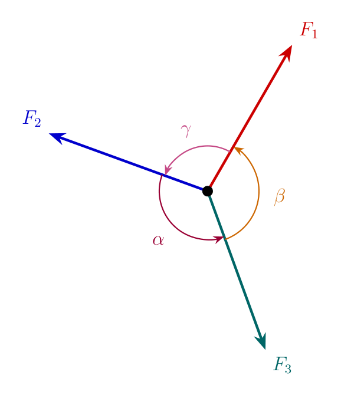
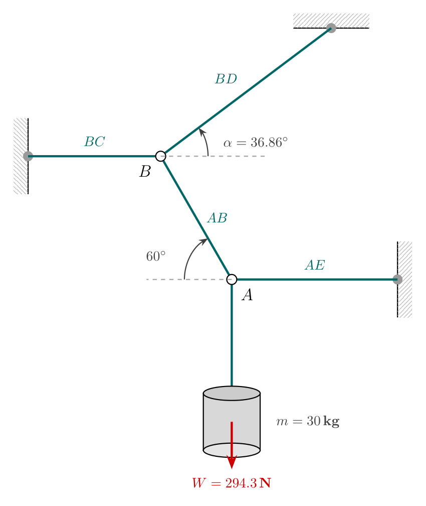
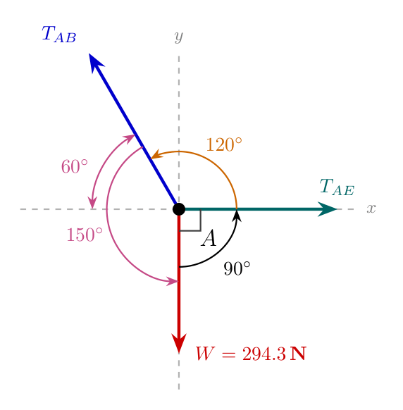
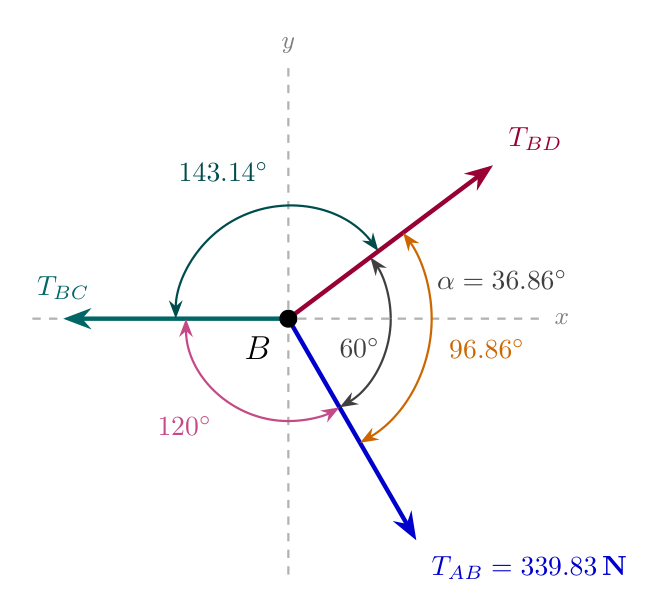

# Lami's Theorem and Concurrent Force Systems in Static Equilibrium

## High-Level Overview

In **Engineering Mechanics**, analyzing static equilibrium involves understanding how forces interact to keep a body completely at rest. When multiple forces act on an object such that their lines of action all intersect at a single common point, they are called **concurrent forces**. If all these forces lie within the same two-dimensional plane, they form a **coplanar concurrent force system**.

**Lami's Theorem** is a powerful mathematical principle derived from the law of sines. It offers a fast, simplified approach to solving coplanar, concurrent three-force equilibrium problems without needing to resolve forces into orthogonal $x$ and $y$ rectangular components.

---

## Fundamental Concepts & Core Terminology

Before applying Lami's Theorem, it is essential to understand the foundational principles governing force systems in statics:

* **Force ($\vec{F}$):** A vector quantity representing an interaction that changes or tends to change the state of rest or motion of a body. Measured in Newtons ($\text{N}$) or kiloNewtons ($\text{kN}$).
* **Mass vs. Weight:** Mass ($m$) is a measure of the amount of matter in an object, expressed in kilograms ($\text{kg}$). Weight ($W$) is the gravitational force exerted on that mass:
  $$W = m \cdot g$$
  *(where $g = 9.81\,\text{m/s}^2$ is the standard acceleration due to gravity).*
* **Tension Force ($T$):** A pulling force transmitted axially through a flexible cord, rope, or cable. Tension always pulls **away** from the point or joint being analyzed.
* **Concurrent Forces:** A set of forces whose lines of action pass through a single common point.
* **Coplanar Forces:** Forces that lie in the same two-dimensional plane.
* **Static Equilibrium:** A state in which a system is at rest because the vector sum of all forces acting on it is zero ($\Sigma \vec{F} = 0$).

---

## Lami's Theorem

### Mathematical Statement
Lami's Theorem states that if **three coplanar, concurrent forces** acting on a body keep it in static equilibrium, then the magnitude of each force is directly proportional to the sine of the angle between the remaining two forces.

> **Visual Description:** Three forces $F_1$, $F_2$, and $F_3$ act outward from a central origin point. The angle directly opposite to force $F_1$ (between $F_2$ and $F_3$) is labeled $\alpha$. The angle directly opposite to force $F_2$ (between $F_1$ and $F_3$) is labeled $\beta$. The angle directly opposite to force $F_3$ (between $F_1$ and $F_2$) is labeled $\gamma$.

### Mathematical Equation
$$\frac{F_1}{\sin \alpha} = \frac{F_2}{\sin \beta} = \frac{F_3}{\sin \gamma}$$

Where:
* $F_1, F_2, F_3$ are the magnitudes of the three forces.
* $\alpha$ is the angle between $\vec{F}_2$ and $\vec{F}_3$.
* $\beta$ is the angle between $\vec{F}_1$ and $\vec{F}_3$.
* $\gamma$ is the angle between $\vec{F}_1$ and $\vec{F}_2$.
* $\alpha + \beta + \gamma = 360^\circ$.

---

### Prerequisites & Rules for Applying Lami's Theorem

To apply Lami's Theorem correctly without mathematical errors, three strict criteria must be satisfied:

1. **Exactly Three Forces:** The system at the joint or point must consist of precisely **three** forces. (If there are 4 or more forces, standard component resolution $\Sigma F_x = 0, \Sigma F_y = 0$ must be used instead).
2. **Coplanar and Concurrent:** All three force vectors must lie in the same plane and intersect at the same central point.
3. **Directional Consistency (All-Outward or All-Inward):** All three force vectors must either point **away** from the joint (divergent/pulling) or all point **towards** the joint (convergent/pushing). They cannot be mixed.

---

## Step-by-Step Problem-Solving Methodology

When solving multi-cord or interconnected cable systems:

1. **Identify Free Body Diagram (FBD) Nodes:** Identify concurrent points where unknown forces meet known loads or other cables.
2. **Convert Mass to Weight:** Convert any load given in $\text{kg}$ to Weight in Newtons ($W = m \times 9.81$).
3. **Determine Geometric Angles:** Use basic geometry, trigonometry ($\tan^{-1}, \sin, \cos$), and alternate interior/complementary angle rules to find the angles between vectors.
4. **Isolate Concurrent Joints (Sequential Analysis):** 
   * Begin at a joint with **only two unknowns** and one known force.
   * Draw the FBD for the joint.
   * Calculate internal angles opposite to each force vector.
   * Apply Lami's Theorem ratio equations to determine unknown tensions.
5. **Propagate Forces:** Carry calculated tension forces forward as known inputs to adjacent joints until all cord tensions are resolved.

---

## Comprehensive Worked Example: Five-Cord Suspended System

### Problem Statement
A pipe with a mass of $30\,\text{kg}$ is supported at joint $A$ by a system of five cords ($AB$, $AE$, $BC$, $BD$, and the vertical hanging cord holding the pipe). 

The geometrical configuration is given as follows:
* Joint $A$ supports the $30\,\text{kg}$ pipe hanging vertically downwards ($W$).
* Cord $AE$ extends horizontally to the right from joint $A$.
* Cord $AB$ extends upwards and to the left from joint $A$, inclined at an angle of $60^\circ$ relative to the horizontal line at $A$.
* Cord $BC$ extends horizontally to the left from joint $B$.
* Cord $BD$ extends upwards and to the right from joint $B$, at an angle $\alpha = \tan^{-1}\left(\frac{3}{4}\right) = 36.86^\circ$ relative to the horizontal.
* Cord $AB$ connects joint $A$ to joint $B$.

Determine the tension force in each of the five cords required to maintain static equilibrium.

> **Visual Description:** Complete structural layout showing joint $A$ and joint $B$. A $30\,\text{kg}$ pipe hangs vertically from joint $A$. Cord $AE$ runs horizontally rightward to a fixed wall. Cord $AB$ connects joint $A$ to joint $B$ slanting upwards and leftwards at $60^\circ$ to the horizontal. From joint $B$, cord $BC$ runs horizontally leftward to a wall, and cord $BD$ extends upwards and rightwards at an angle $\alpha = 36.86^\circ$ to a ceiling support.

---

### Phase 1: Convert Mass to Weight
Given mass $m = 30\,\text{kg}$:
$$W = m \cdot g = 30\,\text{kg} \times 9.81\,\text{m/s}^2 = 294.3\,\text{N}$$

The vertical cord directly supporting the pipe carries a tension equal to the weight of the pipe:
$$\mathbf{T_{\text{pipe}} = 294.3\,\text{N} \quad (\downarrow)}$$

---

### Phase 2: Analysis of Joint A

#### Step 1: Draw Free Body Diagram at Joint A
At Joint $A$, three forces interact:
1. $W = 294.3\,\text{N}$ directed vertically downwards.
2. $T_{AE}$ directed horizontally to the right along line $AE$.
3. $T_{AB}$ directed pulling away along cord $AB$ (upwards and to the left at $60^\circ$ above the negative horizontal axis).

> **Visual Description:** Concurrent force system at origin $A$. Force $W = 294.3\,\text{N}$ points down along the negative y-axis. Force $T_{AE}$ points right along the positive x-axis. Force $T_{AB}$ points into the second quadrant at $60^\circ$ above the negative x-axis. The angle between $T_{AE}$ and $W$ is $90^\circ$. The angle between $T_{AB}$ and $T_{AE}$ is $120^\circ$. The angle between $T_{AB}$ and $W$ is $150^\circ$.

#### Step 2: Calculate Angles Between Forces at Joint A
* **Angle between $T_{AE}$ and $W$:**
  $$\theta_{AE-W} = 90^\circ$$
* **Angle between $T_{AB}$ and $T_{AE}$:**
  $$\theta_{AB-AE} = 180^\circ - 60^\circ = 120^\circ$$
* **Angle between $T_{AB}$ and $W$:**
  $$\theta_{AB-W} = 60^\circ + 90^\circ = 150^\circ$$

*(Check angle sum: $90^\circ + 120^\circ + 150^\circ = 360^\circ$)*

#### Step 3: Apply Lami's Theorem at Joint A
$$\frac{W}{\sin(\theta_{AB-AE})} = \frac{T_{AB}}{\sin(\theta_{AE-W})} = \frac{T_{AE}}{\sin(\theta_{AB-W})}$$

Substitute the known values:
$$\frac{294.3}{\sin(120^\circ)} = \frac{T_{AB}}{\sin(90^\circ)} = \frac{T_{AE}}{\sin(150^\circ)}$$

##### 1. Solve for $T_{AB}$:
$$\frac{294.3}{\sin(120^\circ)} = \frac{T_{AB}}{1}$$

$$T_{AB} = \frac{294.3}{0.8660}$$
$$\mathbf{T_{AB} = 339.83\,\text{N}}$$

##### 2. Solve for $T_{AE}$:
$$\frac{294.3}{\sin(120^\circ)} = \frac{T_{AE}}{\sin(150^\circ)}$$

$$T_{AE} = \frac{294.3 \times \sin(150^\circ)}{\sin(120^\circ)} = \frac{294.3 \times 0.5}{0.8660}$$
$$\mathbf{T_{AE} = 169.91\,\text{N}}$$

---

### Phase 3: Analysis of Joint B

#### Step 1: Geometry & Transferred Forces
From equal and opposite action-reaction principles, the tension force in cord $AB$ acts pulling **away** from joint $B$ (downwards and to the right at $60^\circ$ to the horizontal).
* Magnitude of transferred force: $T_{AB} = 339.83\,\text{N}$.
* Angle of cord $BD$: $\alpha = \tan^{-1}\left(\frac{3}{4}\right) = 36.86^\circ$ above the horizontal.

#### Step 2: Draw Free Body Diagram at Joint B
At Joint $B$, three forces interact:
1. $T_{BC}$ directed horizontally to the left.
2. $T_{BD}$ directed upwards and to the right at $36.86^\circ$ to the horizontal.
3. $T_{AB} = 339.83\,\text{N}$ directed downwards and to the right at $60^\circ$ to the horizontal.

> **Visual Description:** Concurrent force system at origin $B$. Force $T_{BC}$ points along the negative horizontal axis. Force $T_{BD}$ points into the first quadrant at $36.86^\circ$ above the positive horizontal axis. Force $T_{AB}$ points into the fourth quadrant at $60^\circ$ below the positive horizontal axis. The angle between $T_{BD}$ and $T_{AB}$ is $96.86^\circ$. The angle between $T_{BC}$ and $T_{AB}$ is $120^\circ$. The angle between $T_{BC}$ and $T_{BD}$ is $143.14^\circ$.

#### Step 3: Calculate Angles Between Forces at Joint B
* **Angle between $T_{BD}$ and $T_{AB}$ ($\gamma$):**
  $$\gamma = 36.86^\circ + 60^\circ = 96.86^\circ$$
* **Angle between $T_{BC}$ and $T_{AB}$ ($\beta$):**
  $$\beta = 180^\circ - 60^\circ = 120^\circ$$
* **Angle between $T_{BC}$ and $T_{BD}$ ($\alpha$):**
  $$\alpha = 180^\circ - 36.86^\circ = 143.14^\circ$$

*(Check angle sum: $96.86^\circ + 120^\circ + 143.14^\circ = 360^\circ$)*

#### Step 4: Apply Lami's Theorem at Joint B
$$\frac{T_{AB}}{\sin(\theta_{BC-BD})} = \frac{T_{BD}}{\sin(\theta_{BC-AB})} = \frac{T_{BC}}{\sin(\theta_{BD-AB})}$$

$$\frac{339.83}{\sin(143.14^\circ)} = \frac{T_{BD}}{\sin(120^\circ)} = \frac{T_{BC}}{\sin(96.86^\circ)}$$

##### 1. Solve for $T_{BD}$:
$$T_{BD} = \frac{339.83 \times \sin(120^\circ)}{\sin(143.14^\circ)}$$

$$\sin(143.14^\circ) \approx 0.5999, \quad \sin(120^\circ) \approx 0.8660$$

$$T_{BD} = \frac{339.83 \times 0.8660}{0.5999}$$
$$\mathbf{T_{BD} = 490.58\,\text{N}}$$

##### 2. Solve for $T_{BC}$:
$$T_{BC} = \frac{339.83 \times \sin(96.86^\circ)}{\sin(143.14^\circ)}$$

$$\sin(96.86^\circ) \approx 0.9928$$

$$T_{BC} = \frac{339.83 \times 0.9928}{0.5999}$$
$$\mathbf{T_{BC} = 562.39\,\text{N}}$$

---

## Final Results Summary Table

| Cord Designation | Structural Role / Connection | Force Magnitude ($\text{N}$) | Direction / Orientation |
| :--- | :--- | :--- | :--- |
| **Vertical Load Cord** | Suspends $30\,\text{kg}$ pipe directly | $294.30\,\text{N}$ | Vertically Downward ($270^\circ$) |
| **Cord $AE$** | Connects Joint $A$ to Wall $E$ | $169.91\,\text{N}$ | Horizontally Rightward ($0^\circ$) |
| **Cord $AB$** | Connects Joint $A$ to Joint $B$ | $339.83\,\text{N}$ | Inclined $60^\circ$ to horizontal |
| **Cord $BD$** | Connects Joint $B$ to Ceiling $D$ | $490.58\,\text{N}$ | Inclined $36.86^\circ$ to horizontal |
| **Cord $BC$** | Connects Joint $B$ to Wall $C$ | $562.39\,\text{N}$ | Horizontally Leftward ($180^\circ$) |