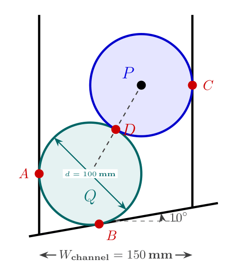
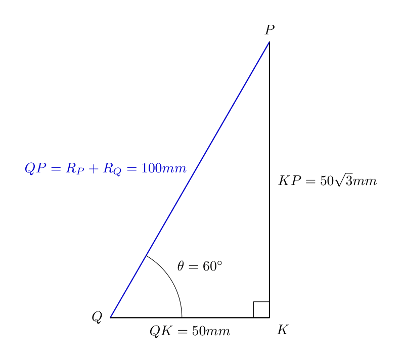
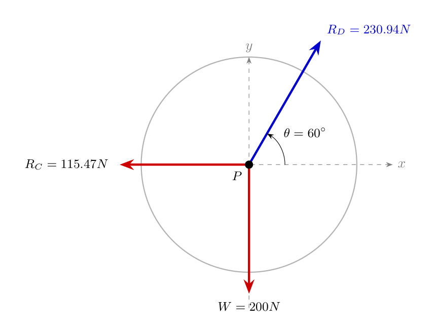
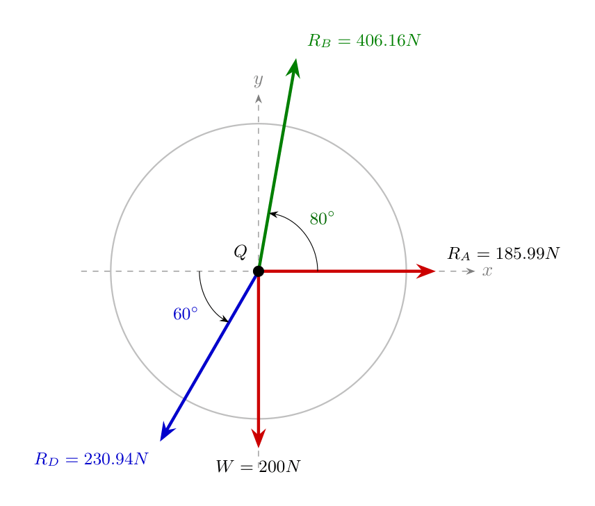

# Analysis of Smooth Contacting Cylinders in Equilibrium

## 1. High-Level Overview

In structural and mechanical engineering, determining how objects support each other and interact with constraining walls is a foundational task. When smooth cylindrical objects are placed together inside a channel or container, they exert contact forces on one another and on the boundaries. 

To determine the unknown support reactions:
* **Smooth Surfaces:** A "smooth" surface implies zero friction. Therefore, reaction forces act strictly **perpendicular (normal)** to the tangent at the point of contact.
* **Line of Action:** For circular cylinders, any normal contact force acts along a line passing through the center of the circle.
* **Equilibrium:** An object at rest satisfies static equilibrium, meaning the net forces acting on it in any direction sum to zero ($\sum F_x = 0$, $\sum F_y = 0$). Alternatively, for three coplanar, concurrent, non-parallel forces, **Lami's Theorem** can be applied.

---

## 2. Fundamental Principles & Geometry Setup

Consider two identical smooth cylinders placed inside a channel.

### System Parameters
* **Diameter of each cylinder ($d$):** $100\text{ mm} \implies \text{Radius } (R) = 50\text{ mm}$
* **Weight of each cylinder ($W$):** $200\text{ N}$
* **Channel Width ($W_{\text{channel}}$):** $150\text{ mm}$
* **Incline Angle of Base Surface:** $10^\circ$ relative to the horizontal

*Description of Visual Layout:*
A vertical channel of width $150\text{ mm}$ with a bottom floor inclined upwards to the right at an angle of $10^\circ$. Two cylinders are stacked inside: lower cylinder $Q$ contacts the left vertical wall at $A$ and the inclined floor at $B$. Upper cylinder $P$ rests on top of cylinder $Q$ at contact point $D$ and touches the right vertical wall at $C$. Center of lower cylinder is $Q$, center of upper cylinder is $P$.

---

### Contact Reaction Summary
1. **At Point $A$ (Left Vertical Wall on Cylinder $Q$):** Reaction force $R_A$ acts horizontally to the right.
2. **At Point $B$ (Inclined Floor on Cylinder $Q$):** Reaction force $R_B$ acts perpendicular to the $10^\circ$ inclined surface, directing inward toward center $Q$.
3. **At Point $C$ (Right Vertical Wall on Cylinder $P$):** Reaction force $R_C$ acts horizontally to the left.
4. **At Point $D$ (Contact between Cylinder $P$ and $Q$):** Mutual normal contact reaction $R_D$ acts along the line connecting centers $Q$ and $P$.

---

## 3. Geometric Derivations

To analyze force components, we must determine the angle of inclination of the line connecting centers $Q$ and $P$, denoted as angle $\theta$.

*Description of Visual Layout:*
A right-angled triangle formed by hypotenuse $QP$, horizontal leg $QK$, and vertical leg $KP$. Point $Q$ is the center of the left cylinder, $P$ is the center of the right cylinder, and $K$ is a point horizontally level with $Q$ and vertically aligned with $P$. Angle $\angle PQK = \theta$.

### Step 1: Calculate the Hypotenuse ($QP$)
The distance between centers $Q$ and $P$ equals the sum of their radii:
$$QP = R + R = 50\text{ mm} + 50\text{ mm} = 100\text{ mm}$$

### Step 2: Calculate the Horizontal Distance ($QK$)
The total channel width is $150\text{ mm}$.
* Center $Q$ is located at distance $R = 50\text{ mm}$ from the left wall.
* Center $P$ is located at distance $R = 50\text{ mm}$ from the right wall.

Therefore, the horizontal distance between centers $Q$ and $P$ is:
$$QK = W_{\text{channel}} - (R + R) = 150\text{ mm} - (50\text{ mm} + 50\text{ mm}) = 50\text{ mm}$$

### Step 3: Compute Angle $\theta$
Using the cosine relation in right triangle $\triangle QKP$:
$$\cos(\theta) = \frac{\text{Adjacent}}{\text{Hypotenuse}} = \frac{QK}{QP}$$

$$\cos(\theta) = \frac{50}{100} = 0.5$$

$$\theta = \arccos(0.5) = 60^\circ$$

Thus, the line connecting the centers of the two cylinders is inclined at **$60^\circ$ to the horizontal**.

---

## 4. Equilibrium Analysis of Cylinder $P$ (Upper Cylinder)

Cylinder $P$ is acted upon by three concurrent forces:
1. Self-weight ($W = 200\text{ N}$) acting vertically downwards.
2. Reaction from right wall ($R_C$) acting horizontally to the left.
3. Reaction from lower cylinder ($R_D$) acting along the line of centers at an angle of $60^\circ$ above the horizontal, directed towards center $P$.

*Description of Visual Layout:*
A point $P$ showing three force vectors: downward weight $W = 200\text{ N}$, horizontal force $R_C$ pointing left, and pushing force $R_D$ acting along a line $60^\circ$ relative to the horizontal pointing up and to the right.

---

### Application of Lami's Theorem
Lami's Theorem states that for three coplanar, concurrent forces in equilibrium:
$$\frac{F_1}{\sin(\alpha)} = \frac{F_2}{\sin(\beta)} = \frac{F_3}{\sin(\gamma)}$$
where $\alpha, \beta, \gamma$ are the angles opposite to forces $F_1, F_2, F_3$.

#### Determining Angles Between Forces at Center $P$:
1. Angle between $W$ ($200\text{ N}$) and $R_C$: $90^\circ$
2. Angle between $R_C$ and $R_D$: 
   * $R_C$ is pointing along the negative x-axis ($180^\circ$).
   * $R_D$ line extends at $60^\circ$ to the horizontal.
   * Angle between $R_C$ and $R_D = 180^\circ - 30^\circ = 150^\circ$
3. Angle between $W$ ($200\text{ N}$) and $R_D$: $90^\circ + 30^\circ = 120^\circ$

#### Formulating Equations:
$$\frac{200}{\sin(120^\circ)} = \frac{R_C}{\sin(150^\circ)} = \frac{R_D}{\sin(90^\circ)}$$

#### Solving for $R_C$:
$$R_C = 200 \cdot \frac{\sin(150^\circ)}{\sin(120^\circ)} = 200 \cdot \frac{0.5}{\frac{\sqrt{3}}{2}} = \frac{200}{\sqrt{3}} \approx 115.47\text{ N}$$

#### Solving for $R_D$:
$$R_D = 200 \cdot \frac{\sin(90^\circ)}{\sin(120^\circ)} = 200 \cdot \frac{1}{\frac{\sqrt{3}}{2}} = \frac{400}{\sqrt{3}} \approx 230.94\text{ N}$$

---

## 5. Equilibrium Analysis of Cylinder $Q$ (Lower Cylinder)

Cylinder $Q$ is subjected to four forces:
1. Self-weight ($W = 200\text{ N}$) acting vertically downward.
2. Reaction from left vertical wall ($R_A$) acting horizontally to the right.
3. Reaction from upper cylinder ($R_D = 230.94\text{ N}$) pushing downwards along the line of centers at $60^\circ$ to the horizontal (by Newton's Third Law).
4. Reaction from the inclined floor ($R_B$).

*Description of Visual Layout:*
Origin $Q$ showing vector $R_A$ along positive x-axis, downward force $200\text{ N}$, contact force $R_D$ pointing down-left at $60^\circ$ to horizontal, and reaction $R_B$ pointing up-right perpendicular to the $10^\circ$ base inclined floor.

---

### Step 1: Determining Angle of Reaction $R_B$
* Floor inclination = $10^\circ$ with horizontal.
* Since $R_B$ is perpendicular to the inclined plane, its angle with the vertical is $10^\circ$, which corresponds to an angle of $90^\circ - 10^\circ = 80^\circ$ with the horizontal.

### Step 2: Resolving Force Components

#### Forces along Vertical axis ($\sum F_y = 0$):
$$\sum F_y = -W - R_D \sin(60^\circ) + R_B \sin(80^\circ) = 0$$

Substitute known values ($W = 200\text{ N}$, $R_D = 230.94\text{ N}$):
$$-200 - (230.94) \sin(60^\circ) + R_B \sin(80^\circ) = 0$$

$$-200 - 200 + R_B \sin(80^\circ) = 0$$

$$-400 + R_B (0.9848) = 0$$

$$R_B = \frac{400}{0.9848} \approx 406.16\text{ N}$$

---

#### Forces along Horizontal axis ($\sum F_x = 0$):
$$\sum F_x = R_A - R_D \cos(60^\circ) - R_B \cos(80^\circ) = 0$$

Substitute known values ($R_D = 230.94\text{ N}$, $R_B = 406.16\text{ N}$):
$$R_A - (230.94) \cos(60^\circ) - (406.16) \cos(80^\circ) = 0$$

$$R_A - (230.94 \times 0.5) - (406.16 \times 0.1736) = 0$$

$$R_A - 115.47 - 70.52 = 0$$

$$R_A = 185.99\text{ N}$$

---

## 6. Summary of Results

| Support Reaction | Location | Magnitude | Direction |
| :--- | :--- | :--- | :--- |
| **$R_A$** | Left Wall (at A) | **$185.99\text{ N}$** | Horizontally to the right ($\rightarrow$) |
| **$R_B$** | Inclined Base (at B) | **$406.16\text{ N}$** | Inclined at $80^\circ$ to horizontal ($\nearrow$) |
| **$R_C$** | Right Wall (at C) | **$115.47\text{ N}$** | Horizontally to the left ($\leftarrow$) |
| **$R_D$** | Contact Point (at D) | **$230.94\text{ N}$** | Along line of centers at $60^\circ$ |